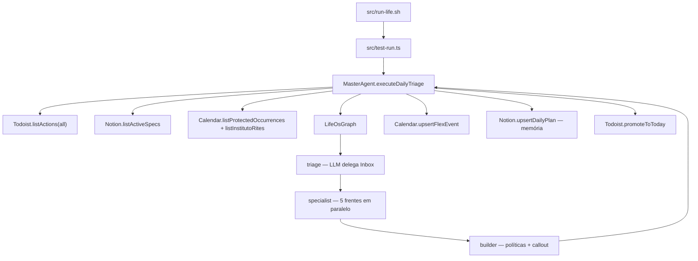

# Life OS

Sistema multi-agentes (Node.js / TypeScript) que orquestra **Todoist**, **Notion** e **Google Calendar** com GTD, PARA e Kanban.

O MAS opera a rotina do Leandro no relógio, sem inflar ruído (TDAH). Cinco especialistas propõem o dia nas suas frentes; um **Agente Mestre** consolida o timeblocking e persiste o que couber nas três ferramentas.

Contrato de comportamento: [`docs/specs`](docs/specs). O código implementa o contrato; o que ainda não existe no `src/` está marcado como gap neste README e no [status das specs](docs/specs/readme.md).

---

## Tese operacional

| Camada | Ferramenta | Entra | Não entra |
|---|---|---|---|
| Relógio | Google Calendar | Compromisso com hora, cue de 1 linha, URL da spec | Conduta, cápsula, 90/5 |
| Ação | Todoist | Ação física que se completa | Uma tarefa por cápsula; uma por tipo de oficina |
| Plano | Notion | Spec do bloco, Kanban, hubs PARA | Execução das 06:00 (Watch não abre Notion) |

PagBank / Engenharia **não** é agente. É restrição de relógio (`ENGENHARIA`, 09:00–12:00 e 13:00–18:00 em dia útil). O Mestre não sobrescreve esses blocos.

Fuso: `America/Sao_Paulo`. O humano não é acordado antes das 06:00.

---

## Estado atual (o que o repositório faz)

A implementação **já começou**. A entrada real é `src/test-run.ts`, disparada por `src/run-life.sh`.

| Peça | No código hoje |
|---|---|
| Kernel Zod + catálogo das 5 frentes + 13 séries protegidas | `src/core/domain` |
| Portas Todoist, Notion, Calendar | `src/core/ports` |
| Adaptadores com SDKs oficiais | `src/adapters/apis` |
| Inversify ligando portas → adaptadores → `MasterAgent` | `src/infrastructure/di` |
| Grafo LangGraph `triage → specialist → builder` | `src/core/domain/orchestrator/LifeOsGraph.ts` |
| Prompts dos 5 especialistas + triagem + callout | `src/core/domain/orchestrator/specialist-prompts.ts` |
| Todoist: listar, promover Hoje, resolver projeto | API real (`@doist/todoist-sdk`) |
| Calendar: listar protegidos/ritos, upsert flex, delete de ocorrência | API real (`googleapis` + OAuth) |
| Notion: query do banco em `NOTION_PROJECTS_DB_ID` | API real (`@notionhq/client`) |
| Notion: Kanban e página Daily Plan | **ainda em memória** (não grava no workspace) |
| Job `node-cron`, `src/jobs`, `src/agents`, `src/index.ts` | **não existem** |
| Portas `ILlmPort` / `IClock` | tokens no DI; **sem adaptador**. O grafo usa `ChatOpenAI` e `Intl` direto |

Ciclo de uma corrida:



O wrapper `src/run-life.sh` grava stdout/stderr em `logs/cron.log`. Não há arquivo em `src/jobs` nem leitura de `LIFE_OS_CRON`. O horário 05:20 da spec 02 é o **contrato**; o crontab da máquina fica fora deste repositório.

---

## Cinco frentes

| Frente | Agente | Prefixo GCal | Projeto Todoist |
|---|---|---|---|
| Mim — Saúde / Vitalidade | Pessoal | `SAUDE` | `🩺 Vitalidade` |
| Casa — Finanças / Manutenção | Infraestrutura Casa | `LAR` | `🏠 Lar` |
| Instituto — Gestão | Profissional Instituto | `INSTITUTO` | `🕍 Instituto` |
| Loja Lua Branca — E-commerce | Operações Loja Lua Branca | `LOJA` | nenhum até existir ação física |
| Família — Suporte | Logística Familiar | `FAMILIA` | `👨 Família` |

Inbox sem projeto (e itens PagBank) são delegados para `ignore_pagbank`: não viram flex nem promoção para Hoje.

---

## Como rodar

Requisitos: Node.js ≥ 20, arquivo `.env` na raiz (veja [`.env.example`](.env.example)).

```bash
npm install
npx tsx src/test-run.ts
```

Ou o wrapper usado no cron:

```bash
bash src/run-life.sh
```

`test-run.ts` chama `executeDailyTriage({ dryRun: false })`: **escreve** no Calendar e no Todoist. Kanban/Daily Plan Notion continuam só em memória.

Scripts do `package.json`:

| Script | Situação |
|---|---|
| `npm run typecheck` | `tsc --noEmit` — existe |
| `npm run build` | emite `dist/` — existe |
| `npm run dev` / `npm start` | apontam para `src/index.ts` / `dist/index.js` — **arquivo ainda não existe** |

---

## Layout do código (árvore real)

```
src/
  test-run.ts                      # entrada da corrida
  run-life.sh                      # wrapper bash → test-run + logs/cron.log
  core/
    domain/
      schemas.ts                   # kernel Zod
      catalog.ts                   # frentes, séries protegidas, hubs
      result.ts                    # Result<T, IntegrationError>
      protected-series.ts          # catálogo in-memory das 13 séries
      orchestrator/
        MasterAgent.ts             # carrega portas, invoca grafo, persiste
        LifeOsGraph.ts             # StateGraph triage → specialist → builder
        specialist-prompts.ts      # system prompts
    ports/
      TodoistPort.ts
      NotionPort.ts
      CalendarPort.ts
      tokens.ts
  adapters/apis/
    TodoistAdapter.ts
    NotionAdapter.ts
    CalendarAdapter.ts
  infrastructure/di/
    inversify.config.ts
docs/specs/                        # contrato SDD
```

Não há `src/agents`, `src/jobs`, `src/adapters/todoist` nem `src/di`. O grafo LangGraph mora no domínio (`orchestrator/`), não numa pasta de agentes.

---

## Specs

| Spec | Papel |
|---|---|
| [Índice e status](docs/specs/readme.md) | O que já existe vs. o que ainda é contrato |
| [Funcionalidade](docs/specs/Funcionalidade.md) | Ciclo diário em prosa, alinhado ao código |
| [00 — Arquitetura](docs/specs/00-architecture-overview.md) | Visão, camadas, kernel, grade, políticas |
| [01 — Integrações](docs/specs/01-api-integrations.md) | Portas, adaptadores, erros, env |
| [02 — Agente Mestre](docs/specs/02-master-agent-orchestrator.md) | CRON, grafo, merge, timeblocking |
| [03 — Especialistas](docs/specs/03-specialist-agents.md) | Cinco frentes, prompts e regras |

Mudança de regra de negócio: atualizar a spec **antes** do código.
