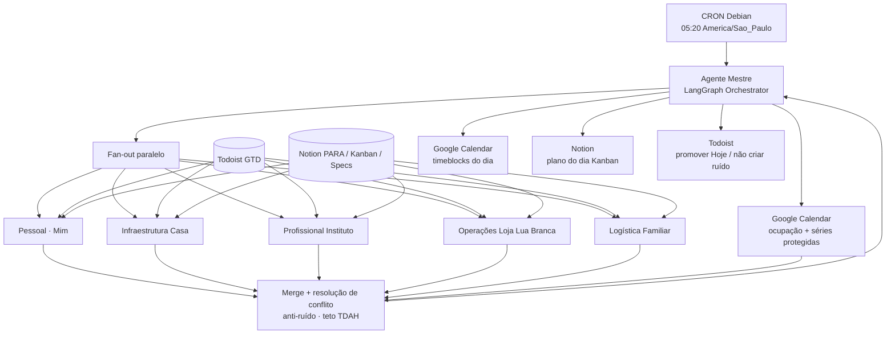
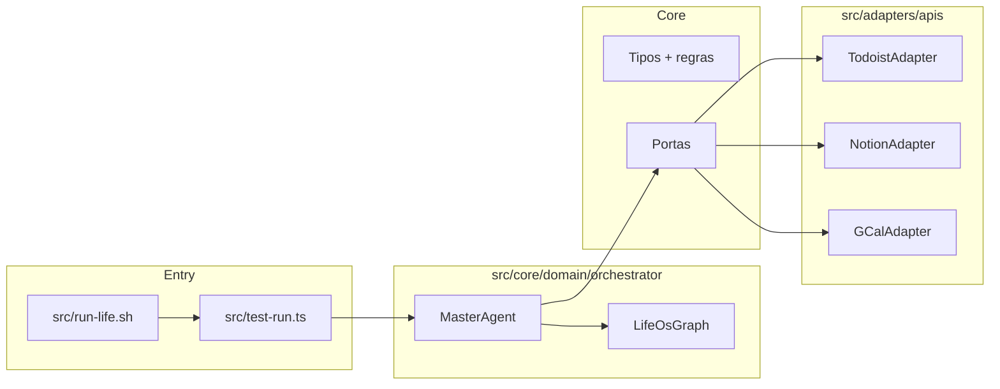
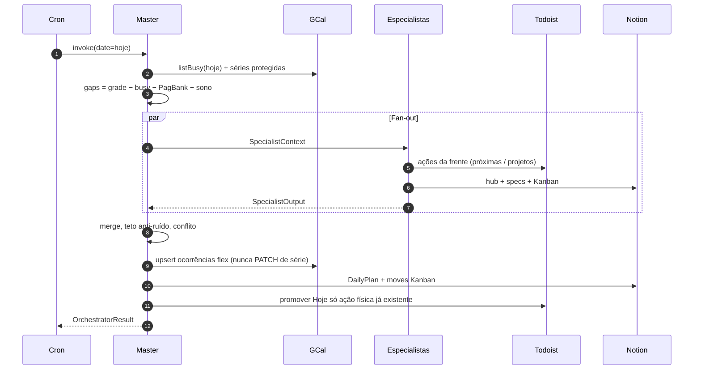

# 00 — Visão geral da arquitetura (Life OS)

**Status:** contrato v0.1 (SDD) · implementação parcial em `src/`  
**Runtime:** Node.js ≥ 20 · TypeScript `strict` · Linux Debian  
**Fuso:** `America/Sao_Paulo`  
**Pessoa:** Leandro Budau Moraes  

Este documento é a **fonte da verdade** das regras. Os demais specs especializam portas, o Agente Mestre e os cinco especialistas. Nenhuma implementação pode contradizer as regras daqui. O mapa do que já existe no código está em [readme.md](./readme.md); o ciclo de uma corrida, em [Funcionalidade.md](./Funcionalidade.md).

---

## 1. Propósito

O Life OS é um **sistema multi-agentes (MAS)** que opera a vida do Leandro no relógio, sem inflar ruído (TDAH). Ele consome ações (Todoist), plano (Notion) e ocupação (Google Calendar), deixa cinco especialistas proporem o dia nas suas frentes, e um **Agente Mestre** consolida um timeblocking executável.

Tese operacional (não negociável):

> Compromisso com hora → Calendar.  
> Ação física que se completa → Todoist.  
> Conduta do bloco → Notion (spec).  
> Porquê → vault PARA (`SecondBrain`).  
> O MAS orquestra as três ferramentas. O vault não é API.

O corpo existe para viver e aprender mais. O dinheiro do lar existe para a família usufruir sem se prejudicar. Instituto espiritualiza e transmite. Loja Lua Branca ajuda a Caroline a organizar, vender em escala e melhorar propaganda. TDAH é restrição do convívio — não um projeto e não um sexto agente.

---

## 2. Três camadas, três sistemas de método

| Método | O que governa | Onde vive |
|---|---|---|
| **GTD** | Captura → próxima ação → esperar → arquivo | Todoist (listas e projetos) |
| **PARA** | Projeto finito / área contínua / recurso / arquivo | Notion (hubs) + vault em disco |
| **Kanban** | Estado de trabalho do dia (`inbox → next → timeblocked → done`) | Notion (board do dia) + estado interno do Mestre |

O MAS **não mistura** as camadas. Um especialista nunca cria evento de cápsula no Calendar, nunca cria spec no Todoist, nunca marca “feito” só no Calendar.

### 2.1 Contrato de camadas

| Camada | Ferramenta | Entra | Não entra |
|---|---|---|---|
| Relógio | Google Calendar (Gmail) | Compromisso com hora, lugar, cue de 1 linha, URL da spec Notion | Parágrafo de conduta, cápsula, 90/5, “controle de atividades” |
| Ação | Todoist | Ação física completável (shot 06:00, pagar luz, 1 entrega Instituto) | Uma tarefa por cápsula; uma tarefa por tipo de oficina; 90/5 |
| Plano | Notion (Second Brain + Specs da Agenda) | Spec do tipo de bloco; Kanban do dia; hubs das 5 frentes | Execução das 06:00 (Watch não abre Notion) |
| Rito | Calendar **Instituto Metatron** (calendário separado) | Data de cerimônia / condução | Oficina semanal (essa mora no Gmail) |
| Porquê | Vault Obsidian `SecondBrain` | Área, propósito, wikilink | Fora do escopo das APIs deste MAS |

---

## 3. Frentes de domínio

O produto opera **cinco frentes**. Há um sexto bloco de relógio (PagBank / Engenharia) que **não tem especialista**: é restrição.

| Frente | Agente especialista | Prefixo GCal | Cor Gmail | Área PARA |
|---|---|---|---|---|
| **Mim** — Saúde / Vitalidade | Pessoal | `SAUDE` | Basil (`10`) | Vitalidade e Longevidade |
| **Casa** — Finanças / Manutenção | Infraestrutura Casa | `LAR` | Tangerine (`6`) | Lar e Prosperidade |
| **Instituto** — Gestão | Profissional Instituto | `INSTITUTO` | Grape (`3`) | Instituto Metatron |
| **Loja Lua Branca** — E-commerce | Operações Loja Lua Branca | `LOJA` | Banana (`5`) | Loja da Caroline |
| **Família** — Suporte | Logística Familiar | `FAMILIA` | Flamingo (`4`) | Pai e Esposo |
| *(restrição)* PagBank | — | `ENGENHARIA` | Blueberry (`9`) | Engenharia e IA |

Título de evento = `PREFIXO - nome curto`. Bloco com dois donos usa **um** prefixo (o que precisa aparecer no relógio). Noite 18:00–20:00 = `FAMILIA`. Quinta 18:00–19:00 = `LOJA`.

---

## 4. Topologia do MAS



### 4.1 Fluxo de dados (contrato)

```
Todoist  ──próximas ações + projetos da frente──► Especialista
Notion   ──hub PARA + specs + cards Kanban──────► Especialista
GCal     ──busy + séries protegidas─────────────► Mestre
Especialista ──TimeBlockProposal[] + KanbanMove[]──► Mestre
Mestre   ──eventos (ocorrência, nunca série)────► GCal
Mestre   ──DailyPlan page + status Kanban───────► Notion
Mestre   ──due/hoje apenas se ação física────────► Todoist
```

Sentido proibido: especialista escrever direto no Calendar. Só o Mestre persiste relógio.

---

## 5. Grade-tipo (restrições de relógio)

O Mestre trata a grade abaixo como **ocupado protegido**. Timeblocking livre só entra em **folgas** (gaps). Folgas típicas: sábado depois das 12:00; dia útil depois das 18:00 (Casa atômica sem `due`, no DATE corrente, sem inventar sábado futuro); domingo depois da Ultra — e somente se um especialista tiver ação física que **precisa de hora**. O gap 08:20–09:00 em dia útil é recusado (`noise_cap`).

| Slot | Dono | Frente / restrição |
|---|---|---|
| 22:00–06:00 Sono | `SAUDE` | Mim — âncora. Série `4shfgjsrs1t9t6pljm8ake8ng0` |
| 06:00–07:05 Casa (Arthur e saída) | `FAMILIA` | Família. Ações de Mim (shot, luz) são **Todoist dentro do bloco**, não eventos |
| 07:15–07:45 Escola Inovação | `FAMILIA` | Família. Carro. R. Antonieta Leitão, 214 |
| 07:50–08:20 Zone 2 (seg–sex) | `SAUDE` | Mim. Av. General Edgar Facó. Depois da escola |
| 09:00–12:00 PagBank coordenação | `ENGENHARIA` | Restrição. PRs, daily, mensagens |
| 12:00–13:00 Almoço | `SAUDE` | Mim. PagBank off. Sem tela |
| 13:00–18:00 PagBank engenharia | `ENGENHARIA` | Restrição. Qua 13:00–14:30 = Lab IA (seção, não série extra) |
| 18:00–20:00 Família / lar | `FAMILIA` | Família + Casa. Seg/ter/sex: 10 min Arthur no início. Qua: após buscar 20:00 |
| Qui 18:00–19:00 Planejamento Caroline | `LOJA` | Família + **1 item** Loja Lua Branca. Ultra 20:00 intacta |
| Ter/Qui 20:00–21:15 Ultra | `SAUDE` | Mim |
| Qua 20:00 buscar Arthur | `FAMILIA` | Família — Ultra não ocorre na quarta |
| Sáb 09:00–12:00 oficina | `INSTITUTO` | Instituto. **Uma** entrega. Não é rito |
| Sáb tarde | `LAR` | Casa. Compras que exigem sair. Sem série própria até existir |
| Dom 07:50–09:20 Ultra | `SAUDE` | Mim |

Regras de âncora:

- Não acordar antes das 06:00. O CRON roda na máquina **antes** (05:20), não no relógio humano.
- Plantão 24 h é **estado**, não série. Apagar ocorrência de sono / Zone 2 / Ultra da noite seguinte. Escola 07:15 **não** se pula.
- Dia de rito no sábado: oficina cede (apagar **ocorrência** da oficina). Rito mora no Calendar Instituto.
- Academia 3× é o teto. Sem pilates. Sem 05:xx.

---

## 6. Arquitetura hexagonal



- **Núcleo** (`src/core`): tipos, políticas, portas, grafo LangGraph. Zero SDK de Todoist/Notion/Google. O grafo **ainda** instancia `ChatOpenAI` (gap: porta `ILlmPort`).
- **Adaptadores** (`src/adapters/apis`): únicos pontos que conhecem `@doist/todoist-sdk`, `@notionhq/client`, `googleapis`.
- **DI** (`src/infrastructure/di`): Inversify liga portas → adaptadores → `MasterAgent`.
- **Entrada** (`src/test-run.ts`, wrapper `src/run-life.sh`). Pastas `src/agents` e `src/jobs` **não existem**. `node-cron` está no `package.json` e não é importado.

Inversão de dependência: o Mestre depende de `TodoistPort` / `ITodoistPort`, nunca de `TodoistApi`.

---

## 7. Layout de código (árvore real)

```
src/
  test-run.ts
  run-life.sh
  core/
    domain/
      schemas.ts
      catalog.ts
      result.ts
      protected-series.ts
      orchestrator/
        MasterAgent.ts
        LifeOsGraph.ts
        specialist-prompts.ts
    ports/
      TodoistPort.ts      # TodoistPort + alias ITodoistPort
      NotionPort.ts
      CalendarPort.ts     # CalendarPort + alias IGoogleCalendarPort
      tokens.ts
      index.ts
  adapters/
    apis/
      TodoistAdapter.ts
      NotionAdapter.ts
      CalendarAdapter.ts
  infrastructure/
    di/
      inversify.config.ts
docs/specs/
```

Ainda não há `src/policies` (políticas vivem em `LifeOsGraph.ts`), `src/agents`, `src/jobs`, adaptador LLM/clock, nem `src/index.ts`. Tokens `ILlmPort` e `IClock` existem em `tokens.ts` sem binding.

---

## 8. Kernel de domínio (contrato TypeScript)

Os módulos `01`, `02` e `03` **reutilizam** estes tipos. Não duplicar com outro nome.

```typescript
/** Fuso canônico do Life OS. */
export const TIME_ZONE = "America/Sao_Paulo" as const;

export type FrontId =
  | "mim"
  | "casa"
  | "instituto"
  | "loja_lua_branca"
  | "familia";

export type AgentId =
  | "pessoal"
  | "infraestrutura_casa"
  | "profissional_instituto"
  | "operacoes_loja_lua_branca"
  | "logistica_familiar"
  | "mestre";

/** Prefixo visível no Gmail. ENGENHARIA é restrição, não frente. */
export type CalendarPrefix =
  | "SAUDE"
  | "LAR"
  | "INSTITUTO"
  | "LOJA"
  | "FAMILIA"
  | "ENGENHARIA";

export type GtdList =
  | "proximas_acoes"
  | "encubar"
  | "arquivar"
  | "projetos";

export type GtdProject =
  | "vitalidade"
  | "lar"
  | "familia"
  | "instituto";

/**
 * Loja Lua Branca não tem projeto Todoist até existir
 * uma ação física nomeada. Engenharia não tem lista.
 */
export type KanbanColumn =
  | "inbox"
  | "next"
  | "waiting"
  | "timeblocked"
  | "done";

export type EnergyLevel = "alta" | "media" | "baixa";

export type ContextTag =
  | "casa"
  | "rua"
  | "carro"
  | "celular"
  | "alta"
  | "baixa"
  | "compra";

/** Instante civil no fuso America/Sao_Paulo, ISO-8601 com offset. */
export interface CivilInstant {
  readonly iso: string;
}

export interface TimeRange {
  readonly start: CivilInstant;
  readonly end: CivilInstant;
}

export interface GtdAction {
  readonly id: string;
  readonly title: string;
  /**
   * Frente PARA. `null` = Inbox ainda sem projeto (ex.: trabalho PagBank
   * vazado na Inbox — restrição de relógio, não frente do Life OS).
   */
  readonly front: FrontId | null;
  readonly project: GtdProject | null;
  readonly list: GtdList;
  readonly due: CivilInstant | null;
  readonly contexts: readonly ContextTag[];
  readonly physical: true;
  readonly url: string;
}

export interface NotionSpecRef {
  readonly pageId: string;
  readonly title: string;
  readonly url: string;
  readonly cue: string;
}

export interface CalendarEventRef {
  readonly eventId: string;
  readonly calendarId: string;
  readonly seriesId: string | null;
  readonly prefix: CalendarPrefix;
  readonly summary: string;
  readonly range: TimeRange;
  readonly protectedSlot: boolean;
  readonly specUrl: string | null;
  readonly cue: string | null;
}

export type TimeBlockKind =
  | "protected_series"
  | "exception_occurrence"
  | "flex_timeblock"
  | "travel_buffer";

export interface TimeBlockProposal {
  readonly agentId: Exclude<AgentId, "mestre">;
  readonly front: FrontId;
  readonly prefix: CalendarPrefix;
  readonly title: string;
  readonly range: TimeRange;
  readonly kind: TimeBlockKind;
  readonly gtdActionId: string | null;
  readonly spec: NotionSpecRef | null;
  readonly cue: string;
  readonly energy: EnergyLevel;
  readonly priority: 0 | 1 | 2 | 3;
  readonly conflictsWithProtected: boolean;
  readonly rationale: string;
}

export interface KanbanMove {
  readonly cardId: string;
  readonly from: KanbanColumn;
  readonly to: KanbanColumn;
  readonly front: FrontId;
  readonly gtdActionId: string | null;
  readonly timeBlock: TimeRange | null;
}

export interface DailyPlan {
  readonly date: string;
  readonly generatedAt: CivilInstant;
  readonly blocks: readonly TimeBlockProposal[];
  readonly kanban: readonly KanbanMove[];
  readonly uncoveredFronts: readonly FrontId[];
  readonly notes: readonly string[];
}

export interface SpecialistContext {
  readonly date: string;
  readonly occupied: readonly CalendarEventRef[];
  readonly freeGaps: readonly TimeRange[];
  readonly actions: readonly GtdAction[];
  readonly specs: readonly NotionSpecRef[];
  readonly kanban: readonly KanbanCard[];
  readonly constraints: SpecialistConstraints;
}

export interface KanbanCard {
  readonly id: string;
  readonly title: string;
  readonly front: FrontId;
  readonly column: KanbanColumn;
  readonly gtdActionId: string | null;
}

export interface SpecialistConstraints {
  readonly plantao: boolean;
  readonly ritoNoSabado: boolean;
  readonly smileOrConsult: boolean;
  readonly maxNewCalendarEvents: number;
  readonly lojaItemLimit: 1;
  readonly institutoDeliveries: 1;
}

export interface SpecialistOutput {
  readonly agentId: Exclude<AgentId, "mestre">;
  readonly front: FrontId;
  readonly proposals: readonly TimeBlockProposal[];
  readonly kanbanMoves: readonly KanbanMove[];
  readonly todoistTodayIds: readonly string[];
  readonly uncovered: boolean;
  readonly warnings: readonly string[];
}

export interface RejectedProposal {
  readonly proposal: TimeBlockProposal;
  readonly reason:
    | "protected_overlap"
    | "pagbank_overlap"
    | "sleep_overlap"
    | "lunch_overlap"
    | "noise_cap"
    | "duplicate_front_flex"
    | "loja_second_item"
    | "instituto_second_delivery"
    | "no_physical_action"
    | "past_slot"
    | "schema_invalid";
}

export interface OrchestratorResult {
  readonly plan: DailyPlan;
  readonly writtenEventIds: readonly string[];
  readonly skipped: readonly string[];
  readonly rejected: readonly RejectedProposal[];
  readonly partial: boolean;
}
```

Mapeamento frente → agente → projeto Todoist:

```typescript
export const FRONT_CATALOG: Record<
  FrontId,
  {
    readonly agentId: Exclude<AgentId, "mestre">;
    readonly prefix: CalendarPrefix;
    readonly gtdProject: GtdProject | null;
    readonly colorId: "10" | "6" | "3" | "5" | "4";
    readonly hubPageId: string;
    readonly hubUrl: string;
  }
> = {
  mim: {
    agentId: "pessoal",
    prefix: "SAUDE",
    gtdProject: "vitalidade",
    colorId: "10",
    hubPageId: "3bef94d816108193bc0fffd4b33c6107",
    hubUrl: "https://app.notion.com/p/3bef94d816108193bc0fffd4b33c6107",
  },
  casa: {
    agentId: "infraestrutura_casa",
    prefix: "LAR",
    gtdProject: "lar",
    colorId: "6",
    hubPageId: "3bef94d81610812ba553f3833971006f",
    hubUrl: "https://app.notion.com/p/3bef94d81610812ba553f3833971006f",
  },
  instituto: {
    agentId: "profissional_instituto",
    prefix: "INSTITUTO",
    gtdProject: "instituto",
    colorId: "3",
    hubPageId: "3bef94d816108174811ee64c4ae57fd8",
    hubUrl: "https://app.notion.com/p/3bef94d816108174811ee64c4ae57fd8",
  },
  loja_lua_branca: {
    agentId: "operacoes_loja_lua_branca",
    prefix: "LOJA",
    gtdProject: null,
    colorId: "5",
    hubPageId: "3bef94d816108148851bc1d07a2c1c8d",
    hubUrl: "https://app.notion.com/p/3bef94d816108148851bc1d07a2c1c8d",
  },
  familia: {
    agentId: "logistica_familiar",
    prefix: "FAMILIA",
    gtdProject: "familia",
    colorId: "4",
    hubPageId: "3bef94d816108192988ffcc41260455a",
    hubUrl: "https://app.notion.com/p/3bef94d816108192988ffcc41260455a",
  },
};
```

---

## 9. Sequência do ciclo diário



Idempotência: o Mestre usa `extendedProperties.private.lifeOsKey` no evento. Reexecução no mesmo dia atualiza o mesmo bloco flex; não duplica.

**Implementação atual do grafo:** três nós — `triage` → `specialist` → `builder` — em `LifeOsGraph.ts`. O Mestre carrega as portas **antes** do grafo. Ocupado vem de `listProtectedOccurrences`, não de `listBusy`. `deleteOccurrence` não é chamado. Persistência Notion de Daily Plan/Kanban é em memória. Detalhe em [Funcionalidade.md](./Funcionalidade.md) e spec 02.

---

## 10. Políticas globais (anti-ruído)

1. **Teto de eventos novos por corrida:** no máximo **3** blocos flex no dia. Protegidos não contam.
2. **Cue ≤ 1 linha.** Corpo do evento = `Cue:` + `Spec:` URL. Sem HTML de conduta.
3. **Não criar** tarefa Todoist a partir do Mestre, salvo promoção de due para Hoje de item **já existente**.
4. **Não criar** spec Notion nova a partir do CRON. Spec nasce de série canônica (Protocolo de Agenda).
5. **Não timeblockar** cápsula, 90/5, “estudar IA”, inglês, segundo item da Loja, pilates.
6. **Violão** como dia inteiro no Todoist **não** vira evento. Ou ganha horário real proposto pelo especialista de Mim/Família, ou fica fora do relógio.
7. **Waiting-for** não tem lista. Vira próxima ação no projeto dono.
8. Etiquetas Todoist = contexto (`Casa`, `Rua`, `Carro`, `Celular`, `Alta`, `Baixa`, `Compra`), nunca pilar.
9. Feriado, lua e calendário Todoist **não entram** no GCal.

---

## 11. Identificadores canônicos (somente leitura neste MAS)

O MAS **não recria** estas séries. IDs do Protocolo de Agenda v1.12:

| Série | ID Gmail |
|---|---|
| SAUDE - Sono | `4shfgjsrs1t9t6pljm8ake8ng0` |
| FAMILIA - Casa | `u9bgqekrb6isudq7ntug21034g` |
| FAMILIA - Escola Inovação | `kms19pgudaa844m142nfs36d8s` |
| SAUDE - Academia ter | `l4mmbnoiapdusv4a81ifma3a44` |
| SAUDE - Academia qui | `l1t5pkkdj6avk10s02cdc14to4` |
| SAUDE - Academia dom | `c2npfh9t7f1s8nq2bbmmuje9no` |
| SAUDE - Zone 2 | `u7bka3nff46blrfphjc52pfiq0` |
| ENGENHARIA - PagBank coordenação | `eg997v16e5ersn8b45gkpkcjn4` |
| SAUDE - Almoço | `aedkngskr8pvsik5qm3a8a2k9o` |
| ENGENHARIA - PagBank engenharia | `0em2de2hu11j5e4qnvafsobioo` |
| FAMILIA - Família / lar | `o46atol4gaj6efqrvep3282u2o` |
| LOJA - Planejamento Caroline | `81hfsp06qj4s52nkr2r1lpj5nk` |
| INSTITUTO - Oficina | `jrpcc165gkfi6nqnbb6gsob4uo` |

Notion:

| Peça | URL |
|---|---|
| Casa Second Brain | https://app.notion.com/p/3bef94d8161081c48a10d74b12ab30f3 |
| Banco Specs da Agenda | https://app.notion.com/p/8c1cc4aeb7264cd1bc8139fa70fe86ad |
| Data source Specs | `collection://dcab9c31-66c7-4812-b3ee-70e69d00f523` |

---

## 12. Segurança e configuração

Variáveis que o código lê hoje (nunca commitadas; ver `.env.example`):

| Variável | Uso |
|---|---|
| `TODOIST_API_TOKEN` | REST Todoist |
| `NOTION_API_KEY` | Integração Notion |
| `NOTION_PROJECTS_DB_ID` | Banco queryado por `listActiveSpecs` |
| `GOOGLE_CALENDAR_ID` | Calendário Gmail (`primary` se omitido) |
| `GOOGLE_CALENDAR_INSTITUTO_ID` | Calendário de rito |
| `GOOGLE_CLIENT_ID` | OAuth Google |
| `GOOGLE_CLIENT_SECRET` | OAuth Google |
| `GOOGLE_REFRESH_TOKEN` | OAuth Google |
| `OPENAI_API_KEY` | LLM do grafo (`ChatOpenAI` em `LifeOsGraph`) |
| `OPENAI_MODEL` | Opcional; default `gpt-4o-mini` |

Contrato ainda **não lido** pelo `src/`: `LIFE_OS_TZ`, `LIFE_OS_CRON`, `LIFE_OS_PLANTAO`, `GOOGLE_APPLICATION_CREDENTIALS`, `GOOGLE_OAUTH_*`. Fuso está hardcoded (`America/Sao_Paulo`). CRON é o wrapper `src/run-life.sh`, sem `node-cron`.

Segredos não entram em log. Adaptadores não imprimem tokens.

---

## 13. Fora de escopo (v0.1)

- Sexto agente de Engenharia / PagBank / carreira.
- Write no vault Obsidian, criação de `.obsidian`, biomarcadores.
- Automação Make / Zapier (o MAS **substitui** orquestração futura, não o token local).
- Dashboard extra no Notion. Segunda casa. Spec de Smile, consulta ou rito.
- Spec `LAR` até existir série.
- Agendar rito. Agendar segundo bloco da Loja. Acordar 05:xx.
- Copiar protocolo clínico (doses, stack, IMAO) para evento ou tarefa.

---

## 14. Critério de aceite desta spec

A implementação está correta se, num dia útil sem plantão:

1. As 13 séries protegidas permanecem intactas (sem `PATCH` de série).
2. PagBank 09:00–12:00 e 13:00–18:00 não recebem timeblock de nenhuma frente.
3. Cada especialista roda isolado, só com dados da sua frente.
4. O Mestre é o único writer de Calendar.
5. O plano do dia no Notion reflete o merge, com frentes descobertas explícitas. *(hoje: `upsertDailyPlan` ainda é mapa em memória.)*
6. Todoist Hoje não ganha item inventado pelo LLM.
