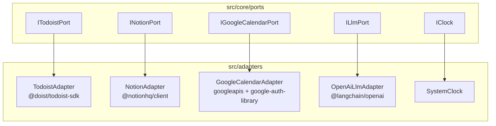

# 01 — Integrações de API (portas e adaptadores)

**Status:** contrato v0.1 (SDD)  
**Depende de:** [00-architecture-overview.md](./00-architecture-overview.md)  
**Princípio:** o domínio **nunca** importa SDK de fornecedor. Cada API tem uma porta, um adaptador, DTOs próprios e erros tipados.

Este spec define o isolamento estrito de Todoist, Notion e Google Calendar. LangChain/OpenAI tem porta à parte (`ILlmPort`) porque o Mestre e os especialistas consomem LLM sem conhecer o provider.

---

## 1. Isolamento



Regras:

1. `import "@doist/todoist-sdk"` só em `src/adapters/todoist/**`.
2. `import "@notionhq/client"` só em `src/adapters/notion/**`.
3. `import "googleapis"` / `google-auth-library` só em `src/adapters/google-calendar/**`.
4. Adaptador traduz SDK → tipos do kernel (`GtdAction`, `CalendarEventRef`, …). Nunca vaza `Task`, `PageObjectResponse`, `calendar_v3.Schema$Event` para agentes.
5. Toda chamada externa tem timeout, retry com backoff e mapeamento de 429/5xx para `IntegrationError`.
6. Idempotência é responsabilidade do adaptador de Calendar (chave `lifeOsKey`) e do adaptador Notion (página do dia indexada por data).

---

## 2. Resultado e erros

```typescript
export type Result<T, E = IntegrationError> =
  | { readonly ok: true; readonly value: T }
  | { readonly ok: false; readonly error: E };

export type IntegrationProvider = "todoist" | "notion" | "google_calendar" | "llm";

export type IntegrationErrorCode =
  | "unauthorized"
  | "not_found"
  | "rate_limited"
  | "timeout"
  | "conflict"
  | "validation"
  | "forbidden_write"
  | "unavailable";

export interface IntegrationError {
  readonly provider: IntegrationProvider;
  readonly code: IntegrationErrorCode;
  readonly message: string;
  readonly retryable: boolean;
  readonly retryAfterMs: number | null;
  readonly cause: unknown;
}

export interface ListQuery {
  readonly date: string;
  readonly front: FrontId | "all";
}
```

Política de retry (adaptador, não agente):

| Código | Retry | Observação |
|---|---|---|
| `rate_limited` | sim, até 3× | Respeitar `Retry-After` |
| `timeout` / `unavailable` | sim, até 2× | Backoff 400 ms → 1600 ms |
| `unauthorized` / `forbidden_write` | não | Falha a corrida inteira |
| `validation` / `not_found` | não | Warning no resultado do Mestre |
| `conflict` | sim, 1× | Re-ler e reaplicar patch |

---

## 3. Relógios e IDs

```typescript
export interface IClock {
  now(): CivilInstant;
  today(): string;
  weekday(date: string): 0 | 1 | 2 | 3 | 4 | 5 | 6;
  inTimeZone(isoUtc: string): CivilInstant;
}

export interface ProtectedSeriesCatalog {
  isProtectedSeries(seriesId: string): boolean;
  prefixOf(seriesId: string): CalendarPrefix | null;
}
```

`IClock` é injetável para testes. Produção usa `America/Sao_Paulo`. `weekday`: 0 = domingo.

---

## 4. Porta Todoist (GTD)

### 4.1 Mapa GTD canônico

Listas (nomes com emoji; filtro usa o nome completo):

| Papel GTD | Nome na conta | Token interno |
|---|---|---|
| Próximas ações | `⏩ Próximas ações` | `proximas_acoes` |
| Encubar | `💤 Encubar` | `encubar` |
| Arquivar | `📌 Arquivar` | `arquivar` |
| Projetos (pai) | `📁 Projetos` | `projetos` |

Projetos filhos (nunca recriar o pai `Leandro Budau Moraes`):

| Frente | Projeto | Token |
|---|---|---|
| Mim | `🩺 Vitalidade` | `vitalidade` |
| Casa | `🏠 Lar` | `lar` |
| Família | `👨 Família` | `familia` |
| Instituto | `🕍 Instituto` | `instituto` |
| Loja Lua Branca | — | `null` até existir ação física nomeada |
| Engenharia | — | **proibido** criar |

Etiquetas permitidas (contexto, não pilar): `Casa` `Rua` `Carro` `Celular` `Alta` `Baixa` `Compra`.

Favoritos Watch (somente leitura, não gerir via API neste MAS): Hoje, Rápidas, Casa, Fora, Celular, Compras.

Tarefas de saúde conhecidas (não duplicar; IDs no vault `Integração Todoist Make`):

| Título | Quando | Completar significa |
|---|---|---|
| Ao acordar | seg–sex 06:00 | B12 · shot · luz 5 min · Arthur · sair 07:00 |
| Ao acordar (domingo) | dom 06:00 | B12 · shot · luz |
| Café / bloco 03 | seg–sex 08:20 | Maca + tribulus + café |
| Vinagre + bloco 05 | seg–sex 11:45 | Vinagre; lipossolúveis no almoço |
| ZMA | 21:15 (ter/qui ~21:20) | Estômago vazio antes de 22:00 |
| Oficina Instituto — 1 entrega | sáb 09:00 (`6hHMfQXRQWqXCWJx`) | Uma entrega feita |

### 4.2 Contrato da porta

```typescript
export interface ITodoistPort {
  listActions(query: ListQuery): Promise<Result<readonly GtdAction[]>>;

  getAction(id: string): Promise<Result<GtdAction>>;

  /**
   * Promove item existente para Hoje (due = date).
   * Proibido criar tarefa nova, mudar projeto, ou clonar cápsula.
   */
  promoteToToday(id: string, date: string): Promise<Result<GtdAction>>;

  /**
   * Completar ação física. Calendar nunca marca feito.
   * Só o humano (Watch) ou um comando explícito futuro.
   * v0.1: o CRON NÃO completa tarefas.
   */
  complete(id: string): Promise<Result<void>>;

  resolveProject(token: GtdProject): Promise<Result<{ id: string; name: string }>>;
}
```

### 4.3 Regras de negócio do adaptador Todoist

1. `listActions({ front })` filtra pelo projeto da frente. `front: "all"` só o Mestre usa para auditoria, não para timeblocking.
2. Itens em `encubar` e `arquivar` **não** entram em `TimeBlockProposal`.
3. Item sem `physical: true` (título genérico, dia inteiro, “controle”) é descartado com warning.
4. `promoteToToday` é a **única** escrita Todoist do ciclo CRON.
5. Rate limit assumido: 50 req/min. O adaptador serializa writes.
6. Token lido de `TODOIST_API_TOKEN`. Nunca logar o token. Nunca ler `.obsidian`.

### 4.4 DTO interno (antes de mapear para `GtdAction`)

```typescript
export interface TodoistTaskSnapshot {
  readonly id: string;
  readonly content: string;
  readonly projectId: string;
  readonly sectionId: string | null;
  readonly labels: readonly string[];
  readonly dueDate: string | null;
  readonly dueDatetime: string | null;
  readonly isCompleted: boolean;
  readonly url: string;
}
```

Mapeamento: `content` → `title`; labels ∩ contextos conhecidos → `contexts`; projeto → `front` via catálogo. Label de pilar é **erro de validação** (não usar).

### 4.5 Fora de escopo Todoist

- Criar projeto, seção, etiqueta, filtro, favorito.
- Completar shot/cápsula automaticamente.
- Uma tarefa por cápsula do stack.
- Lista `Aguardando`.
- Sincronizar Todoist → Calendar como dia inteiro.

---

## 5. Porta Notion (PARA + Kanban + Specs)

### 5.1 Superfície canônica

| Peça | Papel | ID / URL |
|---|---|---|
| Casa Second Brain | raiz PARA | `3bef94d8161081c48a10d74b12ab30f3` |
| Specs da Agenda | banco de conduta de bloco | `8c1cc4aeb7264cd1bc8139fa70fe86ad` |
| Data source Specs | query | `dcab9c31-66c7-4812-b3ee-70e69d00f523` |
| Hub Mim | `SAUDE` | `3bef94d816108193bc0fffd4b33c6107` |
| Hub Engenharia | restrição (leitura) | `3bef94d816108172a9b6dce82f81ed86` |
| Hub Casa | `LAR` | `3bef94d81610812ba553f3833971006f` |
| Hub Família | `FAMILIA` | `3bef94d816108192988ffcc41260455a` |
| Hub Instituto | `INSTITUTO` | `3bef94d816108174811ee64c4ae57fd8` |
| Hub Loja Lua Branca | `LOJA` | `3bef94d816108148851bc1d07a2c1c8d` |

Propriedades do banco Specs: `Nome` · `Pilar` · `Prefixo` · `Slot` · `IDs Calendar` · `Cue` · `Status` (`ativo` / `rascunho`). Vista: board **Por pilar**. Não criar outra vista “dashboard”.

Specs ativas (11). Academia Ultra é **uma** spec, três séries.

Template de spec (somente leitura no CRON): Callout · Agora · Não · Se... Cue de manhã autossuficiente no Watch.

Kanban do dia: **uma** página `Daily Plan YYYY-MM-DD` filha do hub ou de um banco dedicado futuro. v0.1: o adaptador cria/atualiza essa página; **não** cria segundo banco de specs.

### 5.2 Contrato da porta

```typescript
export interface NotionHubRef {
  readonly front: FrontId;
  readonly pageId: string;
  readonly url: string;
}

export interface DailyPlanPage {
  readonly pageId: string;
  readonly date: string;
  readonly url: string;
  readonly blocksWritten: number;
}

export interface INotionPort {
  listActiveSpecs(front: FrontId | "all"): Promise<Result<readonly NotionSpecRef[]>>;

  getSpecByCalendarSeries(seriesId: string): Promise<Result<NotionSpecRef>>;

  listKanban(date: string, front: FrontId | "all"): Promise<Result<readonly KanbanCard[]>>;

  applyKanbanMoves(
    date: string,
    moves: readonly KanbanMove[],
  ): Promise<Result<readonly KanbanCard[]>>;

  /**
   * Upsert da página do plano do dia. Idempotente por `date`.
   * Não cria spec de bloco. Não altera hubs.
   */
  upsertDailyPlan(plan: DailyPlan): Promise<Result<DailyPlanPage>>;

  getHub(front: FrontId): Promise<Result<NotionHubRef>>;
}
```

### 5.3 Regras de negócio Notion

1. Query Specs: `Status = ativo` e `Pilar` da frente. `rascunho` não entra no cue do Calendar.
2. Rate limit Notion: **3 req/s**. Adaptador usa fila interna.
3. `upsertDailyPlan` estrutura mínima (TDAH):
   - Título: `Plano YYYY-MM-DD`
   - Callout: 1 frase (primeiro movimento do dia)
   - Tabela: hora · prefixo · cue · frente
   - Lista: frentes descobertas
   - Sem copiar protocolo clínico, sem dump de vault
4. `applyKanbanMoves` só move card existente. Não inventa card a partir do LLM sem `gtdActionId`.
5. Páginas antigas (“Saúde e Bem-estar”, “Loja Lua Branca” legado) **não se misturam** com a casa atual. O adaptador endereça só IDs deste spec.
6. Spec `LAR` **não é criada** aqui. Casa no sábado tarde usa gap, não série.
7. Cue HTML do Gmail **não** é escrito pelo Notion adapter — é o Calendar adapter. Notion só devolve `cue` puro.

### 5.4 DTO de spec (mapeamento)

```typescript
export interface NotionSpecRow {
  readonly pageId: string;
  readonly name: string;
  readonly pilar: string;
  readonly prefixo: CalendarPrefix;
  readonly slot: string;
  readonly calendarIds: readonly string[];
  readonly cue: string;
  readonly status: "ativo" | "rascunho";
  readonly url: string;
}
```

`NotionSpecRef.cue` = propriedade `Cue` (1 linha). Corpo da página (Callout/Agora/Não) **não** vai para o evento.

### 5.5 Fora de escopo Notion

- Criar spec nova, hub, vista, dashboard.
- Spec de Smile, consulta, rito.
- Abrir Notion às 06:00 (produto humano; o MAS só alimenta o plano para depois).
- Duplicar vault clínico.

---

## 6. Porta Google Calendar (relógio)

### 6.1 Calendários

| Calendário | Uso | Write no CRON |
|---|---|---|
| Gmail `primary` (ou `GOOGLE_CALENDAR_ID`) | Grade de vida + timeblocks flex | Sim, **somente ocorrência flex** e delete de ocorrência de exceção |
| Instituto Metatron (`GOOGLE_CALENDAR_INSTITUTO_ID`) | Rito | **Não**. Somente `listBusy` para o Mestre saber se sábado cede |

Cores / `colorId` Gmail:

| Prefixo | colorId |
|---|---|
| `SAUDE` | `"10"` |
| `ENGENHARIA` | `"9"` |
| `LAR` | `"6"` |
| `FAMILIA` | `"4"` |
| `INSTITUTO` | `"3"` |
| `LOJA` | `"5"` |

Corpo do evento (HTML, `notificationLevel` de reminder da série permanece; flex usa reminder 10 min se for deslocamento):

```html
<b>Cue:</b> {cue}<br><b>Spec:</b> <a href="{url}">{specTitle}</a>
```

Sem spec (bloco flex sem página): só `Cue:`. Não inventar URL.

### 6.2 Contrato da porta

```typescript
export interface BusyQuery {
  readonly date: string;
  readonly calendarIds: readonly string[];
}

export interface UpsertFlexEventInput {
  readonly lifeOsKey: string;
  readonly prefix: CalendarPrefix;
  readonly title: string;
  readonly range: TimeRange;
  readonly cue: string;
  readonly specUrl: string | null;
  readonly specTitle: string | null;
  readonly colorId: string;
  readonly transparency: "opaque" | "transparent";
}

export interface DeleteOccurrenceInput {
  readonly eventId: string;
  readonly calendarId: string;
  readonly reason: "plantao" | "smile" | "rito" | "user_exception";
}

export interface IGoogleCalendarPort {
  listBusy(query: BusyQuery): Promise<Result<readonly CalendarEventRef[]>>;

  listProtectedOccurrences(
    date: string,
  ): Promise<Result<readonly CalendarEventRef[]>>;

  /**
   * Cria ou atualiza bloco flex. Nunca PATCH em event.recurringEventId de série protegida.
   */
  upsertFlexEvent(
    input: UpsertFlexEventInput,
  ): Promise<Result<CalendarEventRef>>;

  /**
   * Apaga UMA ocorrência. Proibido delete da série.
   * v0.1: só se o Mestre classificar exceção explícita no contexto (plantão/rito/Smile já no busy).
   */
  deleteOccurrence(
    input: DeleteOccurrenceInput,
  ): Promise<Result<void>>;

  /**
   * Listar ritos no calendário Instituto (busy). Sem write.
   */
  listInstitutoRites(date: string): Promise<Result<readonly CalendarEventRef[]>>;
}
```

### 6.3 Séries protegidas — write fence

```typescript
export const PROTECTED_SERIES_IDS: readonly string[] = [
  "4shfgjsrs1t9t6pljm8ake8ng0",
  "u9bgqekrb6isudq7ntug21034g",
  "kms19pgudaa844m142nfs36d8s",
  "l4mmbnoiapdusv4a81ifma3a44",
  "l1t5pkkdj6avk10s02cdc14to4",
  "c2npfh9t7f1s8nq2bbmmuje9no",
  "u7bka3nff46blrfphjc52pfiq0",
  "eg997v16e5ersn8b45gkpkcjn4",
  "0em2de2hu11j5e4qnvafsobioo",
  "aedkngskr8pvsik5qm3a8a2k9o",
  "o46atol4gaj6efqrvep3282u2o",
  "81hfsp06qj4s52nkr2r1lpj5nk",
  "jrpcc165gkfi6nqnbb6gsob4uo",
];

export function assertNotProtectedWrite(seriesId: string | null): void {
  if (seriesId && PROTECTED_SERIES_IDS.includes(seriesId)) {
    throw Object.freeze({
      provider: "google_calendar",
      code: "forbidden_write",
      message: `Write em série protegida ${seriesId} é proibido`,
      retryable: false,
      retryAfterMs: null,
      cause: null,
    } satisfies IntegrationError);
  }
}
```

O adaptador chama `assertNotProtectedWrite` **antes** de qualquer `events.patch` / `events.delete` que não seja ocorrência de exceção autorizada.

### 6.4 `lifeOsKey` (idempotência)

Formato: `lifeos:{date}:{front}:{gtdActionId|slot}`

Exemplo: `lifeos:2026-08-18:casa:pagar-luz`

`extendedProperties.private.lifeOsKey` + `extendedProperties.private.lifeOs = "1"`.

Busca no upsert: `privateExtendedProperty=lifeOsKey=...` no dia. Se existir, `patch` horário/cue. Se não, `insert`.

### 6.5 Regras de negócio Calendar

1. Título flex = `{PREFIXO} - {nome curto ≤ 48 chars}`.
2. `transparency: "opaque"` para compromisso com lugar; `"transparent"` só para buffer de deslocamento se o Mestre marcar `travel_buffer`.
3. Buffers canônicos (não viram tarefa): escola 15 min, Zone 2 5 min, Ultra 15 min sair, sono 10 min luz. v0.1: buffers **já estão nas séries**. Flex não duplica.
4. Plantão: **não** bloquear 24 h. Só o Mestre pode pedir `deleteOccurrence` de sono / Zone 2 / Ultra da noite seguinte — e somente se `constraints.plantao === true`.
5. Smile/consulta já no Gmail como ocupado: o Mestre **não** cria contra-evento; pode pedir delete da ocorrência de Família / lar que coincide (já feito manualmente em 21/08; o MAS não reabre).
6. Calendário Todoist, lua, feriado: ignorar na listagem se `event.organizer` / calendário não for `primary` ou Instituto.
7. Quota: tratar 403 `rateLimitExceeded` como `rate_limited`.

### 6.6 Auth Google

Ordem:

1. `GOOGLE_APPLICATION_CREDENTIALS` (service account) — só se o calendário estiver compartilhado com o SA.
2. OAuth instalado: `GOOGLE_OAUTH_CLIENT_ID`, `GOOGLE_OAUTH_CLIENT_SECRET`, `GOOGLE_OAUTH_REFRESH_TOKEN`.
3. Escopos mínimos: `https://www.googleapis.com/auth/calendar.events` e `calendar.readonly` no Instituto.

Sem escopo Gmail. Sem Drive. Sem Contacts.

### 6.7 Fora de escopo Calendar

- Criar ou alterar RRULE de série.
- Recolorir série.
- Escrever rito no Calendar Instituto.
- Oito eventos de suplemento.
- Evento de cápsula, 90/5, “controle de atividades”.

---

## 7. Porta LLM

```typescript
export interface LlmMessage {
  readonly role: "system" | "user";
  readonly content: string;
}

export interface LlmStructuredRequest<TSchema> {
  readonly messages: readonly LlmMessage[];
  readonly schemaName: string;
  readonly temperature: 0;
}

export interface ILlmPort {
  completeStructured<T>(
    request: LlmStructuredRequest<unknown>,
    parse: (raw: unknown) => T,
  ): Promise<Result<T>>;
}
```

- Provider default: OpenAI via `@langchain/openai`.
- `temperature: 0`. Sem tools de busca web.
- Saída **sempre** validada com Zod no agente (não no adaptador).
- Falha de parse → `validation`, o especialista devolve `uncovered: true` e zero propostas.

---

## 8. Tokens Inversify (DI)

```typescript
export const TOKENS = {
  Clock: Symbol.for("IClock"),
  Todoist: Symbol.for("ITodoistPort"),
  Notion: Symbol.for("INotionPort"),
  GoogleCalendar: Symbol.for("IGoogleCalendarPort"),
  Llm: Symbol.for("ILlmPort"),
  ProtectedSeries: Symbol.for("ProtectedSeriesCatalog"),
} as const;
```

Binding: `ContainerModule` por adaptador. Testes rebindam para fakes em memória.

---

## 9. Observabilidade mínima

Cada chamada de porta emite:

```typescript
export interface IntegrationLog {
  readonly provider: IntegrationProvider;
  readonly operation: string;
  readonly ok: boolean;
  readonly durationMs: number;
  readonly date: string;
}
```

Sem payload de evento, sem título de tarefa clínica completa se houver dose no texto (o adaptador Todoist **não reescreve** títulos clínicos; o logger trunca em 80 chars).

---

## 10. Critério de aceite desta spec

1. Compilar o núcleo sem `googleapis` / `@notionhq` / `@doist/todoist-sdk` no grafo de `src/core` e `src/agents`.
2. Tentativa de `patch` em série protegida retorna `forbidden_write` sem chamar a API.
3. Dois `upsertFlexEvent` com o mesmo `lifeOsKey` no mesmo dia = um evento.
4. `listActions({ front: "mim" })` não devolve tarefas de `familia` / `lar` / `instituto`.
5. Notion `upsertDailyPlan` duas vezes no mesmo `date` atualiza a mesma página.
6. LLM fora do schema Zod não gera write em nenhuma API.
