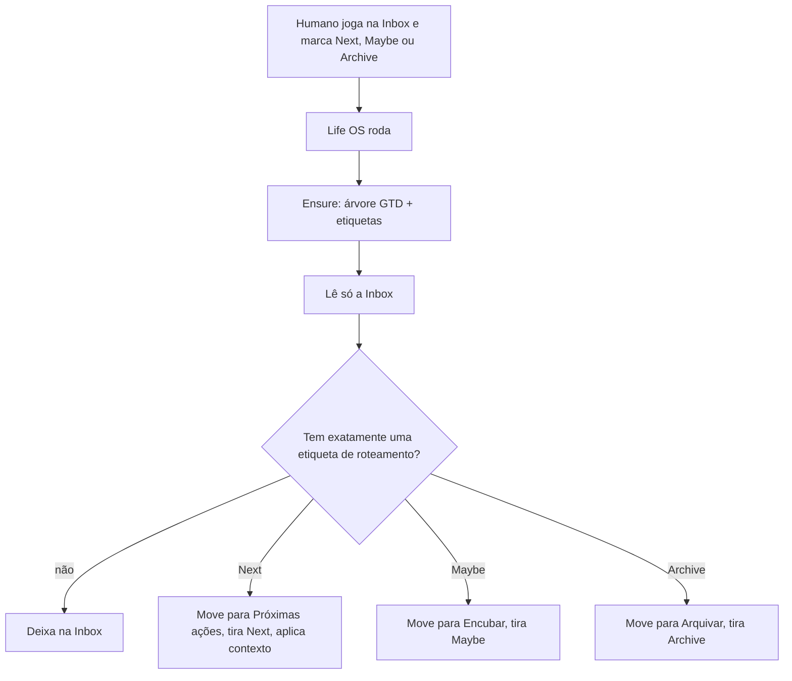

# Spec 01 — Fluxo Todoist

Status: **alinhada** (2026-08-18) — 2ª modificação: bootstrap GTD na primeira corrida  
Código do processador: quando as regras desta nota estiverem fechadas. A conta **não** precisa existir na mão.

Captura humana = **Inbox nativa do Todoist** + **uma** etiqueta de roteamento.  
Toda corrida começa **materializando o GTD** (idempotente). Depois, só processa o que já tem `Next`, `Maybe` ou `Archive`. O resto fica na Inbox.  
**Não marca Hoje.** Engajar fica para o Watch ou spec futura.

Contrato = **nomes canônicos** desta nota. IDs não entram no domínio: servem só de snapshot da conta atual (§8). A mesma spec sobe uma conta vazia ou a do Leandro.

---

## 1. Papel

| Camada | Ferramenta | Entra |
|---|---|---|
| Captura | Inbox nativa do Todoist | Texto solto. Única porta de entrada. |
| Roteamento | Etiquetas `Next` / `Maybe` / `Archive` | O humano escolhe o destino. |
| **Ação** | **Projeto `⏩ Próximas ações`** | Próxima ação física, já filtrada |
| Algum dia | **Projeto `💤 Encubar`** | Pertence à vida, mas não será pego ainda |
| Referência | **Projeto `📌 Arquivar`** | Guardar, não fazer |
| Projetos PARA | Pasta `📁 Projetos` + um projeto por pilar | Onde mora o trabalho de longo prazo. **Não** recebem item desta corrida da Inbox |
| Relógio | Google Calendar | Contexto de leitura. Sem evento e sem due nesta corrida. |
| Plano | Notion | Fora desta spec |
| Porquê | Vault | Contexto que o LLM pode ler (só para `Next`) |

O humano **adiciona na Inbox** e **marca o destino** com uma etiqueta de roteamento. Não escolhe projeto nem data.

TDAH: um inbox. Um destino por item. Sem explodir um texto em cinco tarefas.

---

## 2. Árvore GTD (norma desta spec)

Listas GTD e projetos de verdade **não se misturam**. Inbox é a nativa — nunca um projeto chamado Inbox.

```
Inbox                          ← nativa; não criar
⏩ Próximas ações              ← lista GTD (raiz)
💤 Encubar                     ← lista GTD (raiz) — algum dia / talvez
📌 Arquivar                    ← lista GTD (raiz) — referência
📁 Projetos                    ← pasta (projeto-pai)
  🩺 Saúde
  👨 Família
  🏠 Casa
  💰 Financeiro
  🤝 Amizades
  🕍 Instituto
  🌙 Loja Lua Branca
```

| Nome canônico | Tipo | Papel |
|---|---|---|
| `⏩ Próximas ações` | projeto raiz | Destino de `Next` |
| `💤 Encubar` | projeto raiz | Destino de `Maybe` |
| `📌 Arquivar` | projeto raiz | Destino de `Archive` |
| `📁 Projetos` | projeto raiz, pasta | Pai dos pilares |
| `🩺 Saúde` | filho de `📁 Projetos` | Pilar |
| `👨 Família` | filho de `📁 Projetos` | Pilar |
| `🏠 Casa` | filho de `📁 Projetos` | Pilar |
| `💰 Financeiro` | filho de `📁 Projetos` | Pilar |
| `🤝 Amizades` | filho de `📁 Projetos` | Pilar |
| `🕍 Instituto` | filho de `📁 Projetos` | Pilar |
| `🌙 Loja Lua Branca` | filho de `📁 Projetos` | Pilar |

**Não criar nunca**

- Outra Inbox
- Lista `Aguardando` / Waiting — waiting-for vira próxima ação, não lista
- Engenharia / PagBank
- TDAH como projeto
- O pai da conta (`Leandro Budau Moraes` ou equivalente)
- Projeto por órgão, por cápsula, por tipo de oficina
- Etiqueta com nome de pilar

Projetos que o humano já tiver além desta árvore (ex.: `Normalizar o instituto`) **permanecem**. O ensure não apaga, não renomeia e não funde.

### 2.1 Ensure (toda corrida, antes da Inbox)

Idempotente. Resolve por **nome canônico exato** (emoji + texto). Sem match por ID.

Ordem:

1. Listar projetos e etiquetas da conta.
2. Se faltar `📁 Projetos`, criar na raiz.
3. Se faltar lista GTD da raiz (`⏩ Próximas ações`, `💤 Encubar`, `📌 Arquivar`), criar na raiz.
4. Se faltar pilar, criar **já como filho** de `📁 Projetos`.
5. Se faltar etiqueta do catálogo §2.2 ou §2.3, criar com o nome e a cor da tabela.

Se o nome canônico já existe, **reusa** — mesmo que o pai seja outro. Não duplica. Não move. Não reparenta.

Conta vazia + token válido → depois do ensure a árvore e as etiquetas desta nota existem. Nada na mão.

### 2.2 Etiquetas de roteamento

O ensure cria se faltarem. Nomes exatos, em inglês. Só estas três disparam o processador da Inbox.

| Etiqueta | Cor | Destino |
|---|---|---|
| `Next` | `lime_green` | `⏩ Próximas ações` |
| `Maybe` | `yellow` | `💤 Encubar` |
| `Archive` | `grey` | `📌 Arquivar` |

Depois de processar, **remove** a etiqueta de roteamento da tarefa. Ela não viaja com o item.

Item na Inbox **sem** uma dessas três: **ignora**. Não move, não apaga, não reescreve.

Item com **duas ou mais** etiquetas de roteamento: **ignora** (um destino só; o humano desambigua).

### 2.3 Etiquetas de contexto

O ensure cria se faltarem. Só este catálogo. Não inventa dimensão nova (Tempo fica de fora até a spec ganhar nomes).

| Dimensão | Etiqueta | Cor |
|---|---|---|
| Localização | `Casa` | `salmon` |
| Localização | `Rua` | `salmon` |
| Localização | `Carro` | `salmon` |
| Localização | `Celular` | `salmon` |
| Energia | `Alta` | `grape` |
| Energia | `Baixa` | `grape` |
| Espaço | `Compra` | `grape` |
| Tempo | — | ainda sem etiqueta |

Só `Next` ganha contexto. `Maybe` e `Archive` **não** recebem etiqueta nova.

---

## 3. Fluxo ao rodar



Um item processado → **um** destino. Sem data. Sem Hoje.

### 3.1 Filtrar

Para cada item da Inbox:

1. Contar etiquetas `Next`, `Maybe`, `Archive`.
2. Zero ou mais de uma → pular.
3. Uma → organizar (§3.2).

Não lê carga dos pilares nesta fatia. O humano já filtrou o destino.

### 3.2 Organizar

| Etiqueta | Destino | Título | Contexto |
|---|---|---|---|
| `Next` | `⏩ Próximas ações` | Reescreve GTD (§3.3) | Remove `Next`. Aplica etiquetas do catálogo §2.3 |
| `Maybe` | `💤 Encubar` | Não mexe | Remove `Maybe`. Não adiciona etiqueta |
| `Archive` | `📌 Arquivar` | Não mexe | Remove `Archive`. Não adiciona etiqueta |

`💤 Encubar` guarda o que **não será pego ainda**, porém algum dia talvez.

Não marcar due. Não promover a Hoje. Item no destino fica **sem data**.

### 3.3 `Next`: título GTD + contexto

Só neste destino o LLM mexe no conteúdo.

**Título** — o texto cru da Inbox não viaja. O mesmo item é reescrito:

- Verbo no infinitivo + objeto concreto: o que o corpo faz e quando está **feito**.
- Visível e completable numa sessão (`Ligar para Maria Nilda perguntar avaliação TDAH`, não `Família` nem `Melhorar o instituto`).
- Uma ação. Sem lista, sem 90/5, sem cápsula, sem “organizar a oficina”.
- Resultado vago → só a **primeira** ação física; o resto não vira card.

**Contexto** — escolhe **entre o catálogo §2.3** (já garantido pelo ensure):

- Localização: no máximo uma de `Casa` `Rua` `Carro` `Celular`, se óbvio.
- Energia: no máximo uma de `Alta` `Baixa`, se óbvio.
- Espaço: `Compra` só se for compra.
- Tempo: não aplica enquanto a spec não nomear etiquetas nessa dimensão.

Não inventa etiqueta fora do catálogo. Dúvida → não põe aquela dimensão. Nunca etiqueta com nome de pilar.

Etiquetas de contexto que o humano já tiver na tarefa **permanecem**, salvo a de roteamento.

### 3.4 O que o processador não faz

- Processar item sem `Next` / `Maybe` / `Archive`
- Mover para projeto de pilar
- Criar um segundo *item* a partir de um da Inbox (estrutura GTD faltando, o ensure cria; tarefa extra, não)
- Criar etiqueta ou projeto fora das tabelas §2 / §2.2 / §2.3
- Completar tarefa
- Criar evento no Calendar
- Marcar Hoje / `due`
- Etiquetar por pilar
- Aplicar regra dos 2 minutos
- Partir um item em N tarefas
- Aplicar contexto em `Maybe` ou `Archive`
- Apagar, fundir ou reparentar projeto que já exista

---

## 4. Engajar (Hoje)

**Fora desta corrida.** Processar Inbox não põe data.

---

## 5. Porta (quando implementar)

| Método | Uso |
|---|---|
| `listProjects` | Ensure: detectar falta |
| `createProject` | Ensure: criar lista GTD, pasta `📁 Projetos` ou pilar |
| listar / criar etiqueta | Ensure: catálogo §2.2 e §2.3 |
| `listTasks` (Inbox) | Captura filtrada |
| mover / atualizar conteúdo e etiquetas | Organizar |
| `updateTaskDue` | **Não chama** |
| `completeTask` | **Não chama** |

O domínio não importa o SDK. Testes mockam a porta. Nomes canônicos vivem no domínio; o adaptador só traduz.

---

## 6. Tensão com o vault

O Second Brain ainda tem seis pilares, outros nomes, sem Amizades / Financeiro. Engenharia continua só no relógio. Alinhar o vault é outra nota — esta spec manda só na conta Todoist.

---

## 7. Fechado

1. Nenhuma pasta nem etiqueta desta spec se cria na mão. O ensure da corrida materializa a árvore GTD e o catálogo.
2. A spec é portátil: outra conta Todoist + o mesmo token no `.env` chega no mesmo GTD, pelos nomes, não pelos IDs.
3. O humano escolhe o destino com `Next` / `Maybe` / `Archive`. O processador não classifica destino.
4. Sem uma dessas etiquetas (ou com mais de uma) → a tarefa **fica** na Inbox.
5. `Next` → `⏩ Próximas ações`; tira `Next`; reescreve título; aplica contexto do catálogo.
6. `Maybe` → `💤 Encubar`; tira `Maybe`; não adiciona etiqueta.
7. `Archive` → `📌 Arquivar`; tira `Archive`; não adiciona etiqueta.
8. Esta corrida **não** marca Hoje e **não** move para pilar.
9. Sem lista Aguardando. Sem Engenharia. Ensure não apaga o que já existe.

Próximas modificações ficam de fora desta nota até o Leandro pedir.

## 8. Snapshot desta conta (não é contrato)

Leandro, 2026-08-18. Só documentação. O código resolve por nome.

| Nome | ID |
|---|---|
| `⏩ Próximas ações` | `6XmPM78GWhvFG8rX` |
| `💤 Encubar` | `6XmPMFCJGMMQQ5x8` |
| `📌 Arquivar` | `6XmPMGxcjrRp8CWc` |
| `📁 Projetos` | `6hHPV4W46wGrgWVW` |
| `🩺 Saúde` | `6fGcGJpmjQ49X54h` |
| `👨 Família` | `6chHqrXV8FjJx259` |
| `🏠 Casa` | `6hHw9c6qpHQ9cJr2` |
| `💰 Financeiro` | `6hHw9c9559X6x2V8` |
| `🤝 Amizades` | `6hHw9cG32h8JxPP6` |
| `🕍 Instituto` | `6cfjmmqfhW4282hQ` |
| `🌙 Loja Lua Branca` | `6hHw9cMQM8qCCmvv` |
