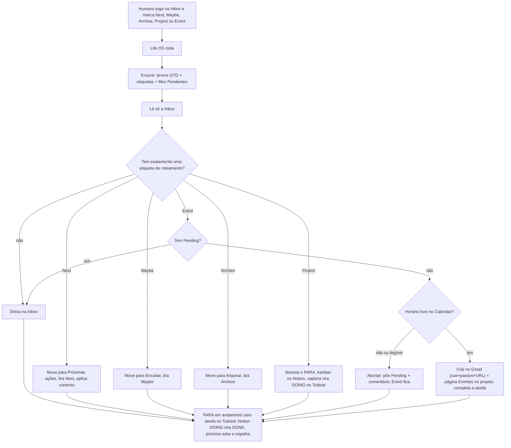

# Spec 01 — Fluxo Todoist

Status: **alinhada** (2026-08-18) — 11ª: `Event` + pilar + histórico Notion + cue no Calendar  
Código do processador: **nesta corrida** (ensure GTD + Inbox + avanço + `Event` com página no projeto). A conta **não** precisa existir na mão.

Captura humana = **Inbox nativa do Todoist** + **uma** etiqueta de roteamento.  
Toda corrida começa **materializando o GTD** (idempotente). Depois processa o que já tem `Next`, `Maybe`, `Archive`, `Project` ou `Event`. O resto fica na Inbox.  
Item `Event` **com** `Pending`: **não varre**. O humano tira `Pending` quando o texto ou o horário estiverem corrigidos.  
Em seguida lê os projetos PARA **em andamento** no Notion: se o Todoist ficou **sem tarefa aberta** (o humano concluiu lá, não no Notion), fecha a `DOING` no kanban e sobe a próxima.  
Projeto com `Status` ≠ `Em andamento` **não** entra nessa análise. O humano pausa no Notion; retoma no Todoist com um `Doing` (ou volta o `Status` para `Em andamento`).  
**Não marca Hoje.** Engajar fica para o Watch ou spec futura.

Contrato = **nomes canônicos** desta nota. IDs não entram no domínio: servem só de snapshot da conta atual (§8). A mesma spec sobe uma conta vazia ou a do Leandro.

---

## 1. Papel

| Camada | Ferramenta | Entra |
|---|---|---|
| Captura | Inbox nativa do Todoist | Texto solto. Única porta de entrada. |
| Roteamento | Etiquetas `Next` / `Maybe` / `Archive` / `Project` / `Event` | O humano escolhe o destino. |
| **Ação** | **Projeto `⏩ Próximas ações`** | Próxima ação física, já filtrada (`Next`) |
| Algum dia | **Projeto `💤 Encubar`** | Pertence à vida, mas não será pego ainda |
| Referência | **Projeto `📌 Arquivar`** | Guardar, não fazer |
| Projetos PARA | Pasta `📁 Projetos` + pilares + **um projeto por resultado finito** | Pilar não recebe item desta corrida. `Project` cria um filho PARA, não move para pilar |
| Relógio | Google Calendar (Gmail) | Caminho `Event`: compromisso esporádico (ou série pedida no texto) se o slot estiver livre. Corpo = cue + passos + URL da página. Sem due no Todoist. |
| Plano | Notion banco `Projects` | `Project`: linha + kanban `Tarefas`. `Event`: linha (pilar em `Selecionar`) + histórico `Eventos` na página — **não** é tarefa. |
| Porquê | Vault | Contexto que o LLM pode ler (`Next` e `Project`) |

O humano **adiciona na Inbox** e **marca o destino** com uma etiqueta de roteamento. Não escolhe pasta, data nem nome final do projeto. No `Event`, o horário mora no **texto** (título + descrição + comentários), não numa due.

TDAH: um inbox. Um destino por item. `Next` / `Maybe` / `Archive` **não** explodem um texto em cinco tarefas. `Project` fatia o resultado no **kanban Notion**; no Todoist entra **só** a `DOING`. `Event` cria **um** compromisso (ou uma série) e **uma** página no histórico do projeto — não N eventos soltos na Inbox.

---

## 2. Árvore GTD (norma desta spec)

Listas GTD e projetos de verdade **não se misturam**. Inbox é a nativa — nunca um projeto chamado Inbox.

Pilares são filhos fixos de `📁 Projetos`. Projetos PARA (resultado finito) também são filhos dessa pasta, **ao lado** dos pilares — nunca com o nome canônico de um pilar.

```
Inbox                          ← nativa; não criar
⏩ Próximas ações              ← lista GTD (raiz)
💤 Encubar                     ← lista GTD (raiz) — algum dia / talvez
📌 Arquivar                    ← lista GTD (raiz) — referência
📁 Projetos                    ← pasta (projeto-pai)
  🩺 Saúde                     ← pilar (ensure)
  👨 Família                   ← pilar (ensure)
  🏠 Casa                      ← pilar (ensure)
  💰 Financeiro                ← pilar (ensure)
  🤝 Amizades                  ← pilar (ensure)
  🕍 Instituto                 ← pilar (ensure)
  🌙 Loja Lua Branca           ← pilar (ensure)
  <resultado PARA>             ← filho criado pelo caminho `Project` (§3.5)
```

| Nome canônico | Tipo | Papel |
|---|---|---|
| `⏩ Próximas ações` | projeto raiz | Destino de `Next` |
| `💤 Encubar` | projeto raiz | Destino de `Maybe` |
| `📌 Arquivar` | projeto raiz | Destino de `Archive` |
| `📁 Projetos` | projeto raiz, pasta | Pai dos pilares **e** dos projetos PARA |
| `🩺 Saúde` | filho de `📁 Projetos` | Pilar |
| `👨 Família` | filho de `📁 Projetos` | Pilar |
| `🏠 Casa` | filho de `📁 Projetos` | Pilar |
| `💰 Financeiro` | filho de `📁 Projetos` | Pilar |
| `🤝 Amizades` | filho de `📁 Projetos` | Pilar |
| `🕍 Instituto` | filho de `📁 Projetos` | Pilar |
| `🌙 Loja Lua Branca` | filho de `📁 Projetos` | Pilar |

**Não criar nunca**

- Outra Inbox
- Lista `Aguardando` / Waiting — waiting-for vira próxima ação, não lista
- Engenharia / PagBank
- TDAH como projeto
- O pai da conta (`Leandro Budau Moraes` ou equivalente)
- Projeto por órgão, por cápsula, por tipo de oficina
- Etiqueta com nome de pilar
- Projeto PARA com o **mesmo nome canônico** de um pilar ou de uma lista GTD

Projetos que o humano já tiver além desta árvore (ex.: `Normalizar o instituto`) **permanecem**. O ensure não apaga, não renomeia e não funde. O caminho `Project` **reusa** se o nome gerado coincidir com um filho já existente de `📁 Projetos`.

### 2.1 Ensure (toda corrida, antes da Inbox)

Idempotente. Resolve por **nome canônico exato** (emoji + texto). Sem match por ID.

Ordem:

1. Listar projetos e etiquetas da conta.
2. Se faltar `📁 Projetos`, criar na raiz.
3. Se faltar lista GTD da raiz (`⏩ Próximas ações`, `💤 Encubar`, `📌 Arquivar`), criar na raiz.
4. Se faltar pilar, criar **já como filho** de `📁 Projetos`.
5. Se faltar etiqueta do catálogo §2.2, §2.3, §2.4 ou §2.5, criar com o nome e a cor da tabela.
6. Se faltar o filtro `Pendentes` (§2.5), criar com o nome e a query da tabela.

Se o nome canônico já existe, **reusa** — mesmo que o pai seja outro. Não duplica. Não move. Não reparenta.

O ensure **não** cria projeto PARA. Isso é só o caminho `Project`.

Conta vazia + token válido → depois do ensure a árvore, as etiquetas e o filtro `Pendentes` desta nota existem. Nada na mão.

### 2.2 Etiquetas de roteamento

O ensure cria se faltarem. Nomes exatos, em inglês. Só estas cinco disparam o processador da Inbox.

| Etiqueta | Cor | Destino |
|---|---|---|
| `Next` | `lime_green` | `⏩ Próximas ações` |
| `Maybe` | `yellow` | `💤 Encubar` |
| `Archive` | `grey` | `📌 Arquivar` |
| `Project` | `blue` | Cria projeto PARA filho de `📁 Projetos` (§3.5) |
| `Event` | `teal` | Cria compromisso no Calendar Gmail **e** página no histórico `Eventos` do projeto Notion (§3.8) |

`Next` / `Maybe` / `Archive` / `Project`: depois de processar, **remove** a etiqueta de roteamento. Ela não viaja com o item.

`Event`: no sucesso, **completa** a tarefa (a instrução foi executada). No conflito ou horário ilegível, **mantém** `Event` e acrescenta `Pending` (§2.5).

Item na Inbox **sem** uma dessas cinco: **ignora**. Não move, não apaga, não reescreve.

Item com **duas ou mais** etiquetas de roteamento: **ignora** (um destino só; o humano desambigua).

### 2.3 Etiquetas de contexto

O ensure cria se faltarem. Só este catálogo. Não inventa dimensão nova (Tempo fica de fora até a spec ganhar nomes).

| Dimensão | Etiqueta | Cor |
|---|---|---|
| Localização | `Casa` | `salmon` |
| Localização | `Rua` | `salmon` |
| Localização | `Carro` | `salmon` |
| Localização | `Celular` | `salmon` |
| Energia | `Alta` | `grape` |
| Energia | `Baixa` | `grape` |
| Espaço | `Compra` | `grape` |
| Tempo | — | ainda sem etiqueta |

Só `Next` e a tarefa **DOING** de um `Project` ganham contexto. `Maybe` e `Archive` **não** recebem etiqueta nova. Tarefas de BACKLOG / TO DO / DONE no Todoist **não** recebem contexto nesta corrida.

### 2.4 Etiqueta de estado (`Project`)

O ensure cria se faltar. Viaja com o item. Não é roteamento: não tira a tarefa da Inbox sozinha.

| Etiqueta | Cor | Papel |
|---|---|---|
| `Doing` | `orange` | Marca a **única** próxima ação do projeto PARA que está em DOING |

No máximo **uma** tarefa com `Doing` por projeto PARA. As demais tarefas daquele projeto não levam `Doing`.

### 2.5 Estado e filtro (`Event`)

O ensure cria se faltarem. `Pending` viaja com o item. Não é roteamento: sozinha **não** tira a tarefa da Inbox.

| Etiqueta | Cor | Papel |
|---|---|---|
| `Pending` | `red` | Trava o `Event`: a corrida **não varre** de novo até o humano **remover** esta etiqueta |

Filtro canônico (Watch / desktop). O humano não cria na mão.

| Nome | Query |
|---|---|
| `Pendentes` | `@Pending` |

Com `Event` + `Pending`: o processador **pula**. Não comenta de novo. Não cria evento. Não tira `Event`.

O humano corrige título/descrição (ou a grade) e **remove só** `Pending`. `Event` permanece — a próxima corrida tenta de novo.

---

## 3. Fluxo ao rodar



Um item `Next` / `Maybe` / `Archive` → **um** destino. Sem data. Sem Hoje.  
Um item `Project` → **um** projeto PARA + quadro completo no Notion + **uma** DOING no Todoist. Sem data. Sem Hoje.  
Um item `Event` → **um** compromisso no Calendar se o slot estiver livre, com página no histórico do projeto Notion; senão aborta e trava com `Pending` (§3.8).  
Depois da Inbox: se o PARA **em andamento** no Todoist ficou vazio (tarefa concluída lá), o Notion espelha `DONE` e ganha a próxima `DOING` (§3.7).

### 3.1 Filtrar

Para cada item da Inbox:

1. Contar etiquetas `Next`, `Maybe`, `Archive`, `Project`, `Event`.
2. Zero ou mais de uma → pular.
3. `Event` com `Pending` → pular (§2.5).
4. Uma → organizar (§3.2, §3.5 ou §3.8).

Não lê carga dos pilares nesta fatia. O humano já filtrou o destino.

### 3.2 Organizar

| Etiqueta | Destino | Título | Contexto |
|---|---|---|---|
| `Next` | `⏩ Próximas ações` | Reescreve GTD (§3.3) | Remove `Next`. Aplica etiquetas do catálogo §2.3 |
| `Maybe` | `💤 Encubar` | Não mexe | Remove `Maybe`. Não adiciona etiqueta |
| `Archive` | `📌 Arquivar` | Não mexe | Remove `Archive`. Não adiciona etiqueta |
| `Project` | Filho novo (ou reusado) de `📁 Projetos` | §3.5 | Remove `Project`. Ver §3.5 |
| `Event` | Calendar Gmail + Notion `Projects` (§3.8) | Não mexe | Sucesso: completa. Falha: mantém `Event`, acrescenta `Pending` |

`💤 Encubar` guarda o que **não será pego ainda**, porém algum dia talvez.

Não marcar due. Não promover a Hoje. Item no destino fica **sem data**.

### 3.3 `Next`: título GTD + contexto

Só neste destino o LLM mexe no conteúdo — salvo o caminho `Project` (§3.5) e o caminho `Event` (§3.8: extrai horário, nomeia o PARA, formata a página e o cue; **não** reescreve a tarefa).

**Título** — o texto cru da Inbox não viaja. O mesmo item é reescrito:

- Verbo no infinitivo + objeto concreto: o que o corpo faz e quando está **feito**.
- Visível e completable numa sessão (`Ligar para Maria Nilda perguntar avaliação TDAH`, não `Família` nem `Melhorar o instituto`).
- Uma ação. Sem lista, sem 90/5, sem cápsula, sem “organizar a oficina”.
- Resultado vago → só a **primeira** ação física; o resto não vira card.

**Contexto** — escolhe **entre o catálogo §2.3** (já garantido pelo ensure):

- Localização: no máximo uma de `Casa` `Rua` `Carro` `Celular`, se óbvio.
- Energia: no máximo uma de `Alta` `Baixa`, se óbvio.
- Espaço: `Compra` só se for compra.
- Tempo: não aplica enquanto a spec não nomear etiquetas nessa dimensão.

Não inventa etiqueta fora do catálogo. Dúvida → não põe aquela dimensão. Nunca etiqueta com nome de pilar.

Etiquetas de contexto que o humano já tiver na tarefa **permanecem**, salvo a de roteamento.

### 3.4 O que o processador não faz

- Processar item sem `Next` / `Maybe` / `Archive` / `Project` / `Event`
- Varrer `Event` que ainda tem `Pending`
- Mover para projeto de **pilar**
- Criar um segundo *item* no **Todoist** a partir de um da Inbox
- Criar etiqueta, projeto ou filtro fora das tabelas §2 / §2.2 / §2.3 / §2.4 / §2.5 e dos PARA gerados em §3.5
- Completar tarefa **no Todoist** (o humano conclui lá; o processador só espelha `DONE` no Notion) — **exceto** o sucesso do caminho `Event` (§3.8)
- Criar evento no Calendar **exceto** o caminho `Event`
- Apagar ou mover série canônica da grade para “abrir” slot
- Criar spec no banco **Specs da Agenda** (consulta / Smile / rito / esporádico). O `Event` grava página no histórico `Eventos` do banco `Projects`, não na spec da grade.
- Marcar Hoje / `due`
- Etiquetar por pilar
- Aplicar regra dos 2 minutos
- Partir um item `Next` / `Maybe` / `Archive` / `Event` em N tarefas
- Criar no Todoist tarefas que no Notion continuam em `BACKLOG` / `TO DO` / `DONE`
- Aplicar contexto em `Maybe`, `Archive` ou `Event`
- Apagar, fundir ou reparentar projeto que já exista
- Replanejar o quadro de um PARA já criado só porque a corrida rodou de novo
- Promover carta para `DOING` se o PARA no Todoist **ainda** tiver tarefa aberta
- Promover carta de projeto cujo `Status` no Notion não é `Em andamento`
- Criar projeto PARA cujo nome coincida com pilar ou lista GTD

### 3.5 `Project`: da Inbox para um projeto PARA

Toda corrida relê a Inbox. Item com exatamente a etiqueta `Project` **não espera** o humano nomear pasta nem quadro.

#### 3.5.1 Ler a captura

O processador lê o item **inteiro**, não só o título:

- título
- descrição / notas
- comentários
- demais conteúdos visíveis da tarefa (links, checklist da descrição)

O título da captura **não** é, por padrão, o nome do projeto.

#### 3.5.2 Nomear o projeto

O LLM propõe **um** nome de resultado PARA:

- Curto. Outcome, não verbo solto. (`Normalizar o instituto`, não `preciso organizar o instituto essa semana` nem `Project`).
- Distinto dos nomes canônicos da §2.
- Se já existir filho de `📁 Projetos` com o **mesmo nome exato**, **reusa** — não duplica, não renomeia, não move.
- Antes de nomear, o LLM vê a lista atual de filhos de `📁 Projetos` (pilares + PARA já existentes) e reusa quando a captura é o mesmo resultado.
- Conteúdo insuficiente para um resultado → **deixa na Inbox**. Não inventa projeto.

#### 3.5.3 Materializar no Todoist

O Todoist só recebe a ação que está em `DOING` no Notion. BACKLOG / TO DO / DONE **não** viram tarefa Todoist nesta corrida.

1. Criar o projeto como **filho de `📁 Projetos`**, com o nome da §3.5.2 (ou reusar o existente).
2. Planejar o quadro (§3.5.4) e materializar **todos** os cards no Notion (§3.6.2).
3. **Converter** o item da Inbox na tarefa **DOING**: move para o projeto PARA, reescreve o título em GTD (§3.3) igual ao card `DOING` do Notion, remove `Project`, aplica `Doing` + contexto §2.3. Sem due.
4. **Não** chamar `createTask` no Todoist para o resto do quadro.
5. Não copiar a DOING para `⏩ Próximas ações`. A ação corrente mora no projeto PARA, marcada com `Doing`.

O item original **não** permanece na Inbox depois de um `Project` bem-sucedido.

Se o projeto PARA **já** tiver uma tarefa com `Doing`, esta captura **fica na Inbox**. Não abre segunda DOING no Todoist.

#### 3.5.4 Planejar as tarefas (kanban Notion)

O script cria o quadro na primeira materialização. Não pede ao humano para fatiar.

Colunas (nomes exatos):

| Coluna | O que entra | Todoist nesta corrida |
|---|---|---|
| `BACKLOG` | Trabalho do resultado que ainda não está na fila próxima | não cria |
| `TO DO` | Próximas ações já esclarecidas, ainda não em curso | não cria |
| `DOING` | **Exatamente uma** ação física, agora | **única** tarefa: a captura convertida |
| `DONE` | Só se a captura já documentar algo concluído; senão, vazia | não cria |

Regras:

- Toda tarefa do quadro é ação GTD (verbo no infinitivo + objeto concreto), no mesmo critério da §3.3.
- **Exatamente uma** tarefa em `DOING`. Se o LLM marcar zero ou duas, o processador força a primeira ação física para `DOING` e o resto para `TO DO` / `BACKLOG`.
- Teto TDAH: o necessário para o resultado, no máximo ~7 cards **no Notion**. O resto fica de fora — não vira microgestão.
- A captura original vira a `DOING` (reescrita). Não duplicar o mesmo texto em dois cards.

Corrida seguinte: **não** reescreve o quadro de um PARA já criado. Só entra de novo na Inbox se aparecer **outro** item com `Project` **e** aquele PARA ainda não tiver `Doing`. O avanço de `TO DO` / `BACKLOG` para `DOING` é a §3.7, não um replanejamento.

### 3.6 `Project`: espelho no Notion

Banco canônico desta spec: **`Projects`**, o mesmo de `NOTION_PROJECTS_DB_ID` (página [Projects](https://app.notion.com/p/3c0f94d8161080298749c108aa746c05), filha de MyLife). Não usar o banco “Projetos” de tarot nem “Projetos existentes” de saúde.

Se o banco não existir no `.env`, o caminho `Project` **falha visível** e o item **permanece na Inbox**. Não cria segundo banco de projetos.

#### 3.6.1 Linha do projeto

Uma linha no banco `Projects`:

| Propriedade | Valor |
|---|---|
| `Nome do Projeto` | O mesmo nome PARA da §3.5.2 |
| `Status` | `Em andamento` ao abrir (há uma DOING). Humano pausa com `Pausado` (senão `Não iniciada` / `Concluído`). Só `Em andamento` entra na §3.7 |
| `Selecionar` | Sempre um de `Pessoal` `Familia` `Loja` `Casa` `Instituto`. Na dúvida, `Pessoal`. Não cria opção nova |

Mapa quando o conteúdo aponta para um pilar Todoist:

| Sinal | `Selecionar` |
|---|---|
| Família | `Familia` |
| Casa / financeiro do lar | `Casa` |
| Instituto | `Instituto` |
| Loja Lua Branca | `Loja` |
| Saúde, amizades, Engenharia/IA/carreira, ou dúvida | `Pessoal` |

Linha com o mesmo `Nome do Projeto` já existente → **reusa**. Não duplica.

#### 3.6.2 Kanban na página

A **página da linha** traz o quadro. Não é dashboard na casa Second Brain. Não é o banco Specs da Agenda.

Na primeira materialização, se a página ainda não tiver o quadro:

1. Criar um **banco filho inline** na página, nome `Tarefas`.
2. Propriedades: `Nome` (title) e `Status` (select ou status) com exatamente `BACKLOG`, `TO DO`, `DOING`, `DONE`.
3. Vista **board** agrupada por `Status`, colunas nessa ordem.
4. Criar um card por tarefa planejada na §3.5.4, na coluna correspondente. O card `DOING` é o mesmo título GTD da tarefa Todoist com etiqueta `Doing`.

Se o banco filho / a vista já existirem na página (projeto reusado), **não** apaga cards. Só acrescenta o que esta captura nova exigir **no Notion**. A regra “exatamente uma DOING” vale **por projeto no Todoist**: se já houver `Doing` no Todoist daquele PARA, a captura **fica na Inbox** e o quadro Notion não ganha segunda DOING.

Calendar continua fora. Vault não recebe página desta corrida.

### 3.7 Projetos ociosos: próxima `DOING`

O humano **conclui no Todoist**, não no Notion. O kanban fica stale até a corrida. Depois da Inbox, **toda corrida** lê as linhas do banco Notion `Projects` que já tiverem o banco filho `Tarefas` e cruza com o PARA de mesmo nome no Todoist.

Só linha com `Status` = `Em andamento` entra na análise de avanço. O humano **pausa no Notion** (`Pausado`, `Não iniciada` ou `Concluído`): a corrida não promove, não cria PARA, não abre segunda `DOING`.

Retomada: o humano volta o `Status` para `Em andamento`, **ou** deixa de novo um `Doing` no Todoist depois que o kanban já não tem carta `DOING` (concluiu a ação corrente enquanto estava pausado). Nesse segundo caso a corrida põe `Status` = `Em andamento` e **não promove** (WIP = 1). Se o `Doing` antigo ainda está no Todoist e o kanban ainda tem `DOING`, a pausa vale — não retoma sozinha.

Sinal de avanço (só `Em andamento`): o PARA **não tem nenhuma tarefa aberta** — a `Doing` foi concluída (o `listTasks` do projeto volta vazio). Não olha a coluna do kanban para decidir se o projeto está parado.

Para cada linha:

1. Página sem banco `Tarefas` → ignora. Não cria quadro nesta fatia.
2. `Status` ≠ `Em andamento`:
   1. PARA existente e **vazio**: cards `DOING` viram `DONE` (espelho da conclusão). **Não promove**. Não cria tarefa.
   2. PARA com tarefa `Doing` e kanban **sem** carta `DOING` → retomada: `Status` = `Em andamento`. Não promove.
   3. Senão → ignora.
3. PARA no Todoist **com qualquer tarefa aberta** → **não promove**. WIP = 1. O humano ainda está nela.
4. PARA existente e **vazio** (concluiu no Todoist):
   1. Todo card Notion em `DOING` vira `DONE` — espelho da conclusão.
   2. Escolhe **uma** carta: a primeira `TO DO`; se não houver, a primeira `BACKLOG`. `DONE` nunca sobe.
   3. Sem `TO DO` nem `BACKLOG` → só o espelho `DONE`. Não inventa card.
   4. Move essa carta para `DOING` no Notion.
   5. **Cria** no Todoist a tarefa correspondente: mesmo título GTD, `Doing` + contexto §2.3, sem due. Não copia para `⏩ Próximas ações`.
5. PARA **ainda não existe** no Todoist: não é conclusão. Se o kanban já tem `DOING`, cria o filho de `📁 Projetos` e espelha essa carta. Se não tem, promove a primeira `TO DO` (senão `BACKLOG`) e espelha. Não marca `DONE`.

Projeto que esta mesma corrida acabou de abrir pelo caminho `Project` ainda tem a tarefa no Todoist — a §3.7 o pula.

### 3.8 `Event`: da Inbox para o Calendar e o projeto

Toda corrida relê a Inbox. Item com exatamente a etiqueta `Event` e **sem** `Pending` vira compromisso no Gmail — consulta, reunião pontual, o que o texto pedir. Não entra na série canônica do Protocolo de Agenda. **Não** ganha linha no banco Specs da Agenda.

Além do relógio: o LLM associa **um** pilar (`Selecionar`) e **um** projeto PARA no banco Notion `Projects`. Evento **não** é tarefa: não vai para o kanban `Tarefas` nem vira item no Todoist. A página do projeto ganha (ou reusa) o banco filho **`Eventos`**. Cada captura vira **uma** página nesse histórico, com a conduta formatada.

Exemplo:

- título: `Ao dormir`
- descrição: `Acontecerá todo dia as 22:00.`
- comentários: `Usar nardirin` / `Escovar os dentes` / `dipirona 5g`
- etiqueta: `Event`

A página (não a captura crua) fica no template TDAH: callout com o primeiro passo; **Agora** em passos numerados, melhorados; **Não** (o que quebra o bloco). O Calendar **não** despeja o parágrafo da Inbox: corpo = cue (1 linha autossuficiente) + passos curtos + `Spec:` URL dessa página.

Outro exemplo pontual: título `Consulta com nutrologo`, descrição `Será todo dia as 10:00.` — o mesmo fluxo (slot + projeto + página + cue).

#### 3.8.1 Ler a captura

O processador lê o item **inteiro**, não só o título:

- título
- descrição / notas
- comentários
- demais conteúdos visíveis da tarefa (links, checklist da descrição)

O LLM extrai **um** intervalo em `America/Sao_Paulo` **e** o envelope Notion:

- `summary`: o título da tarefa, sem reescrever em GTD
- início (data + hora)
- fim: o texto; se só houver hora de início, **60 minutos**
- recorrência, se o texto pedir (`todo dia`, `toda terça`, até quando)
- `projectName`: resultado PARA curto. Se já existir linha no banco `Projects` com o **mesmo nome exato**, **reusa**. Distinto dos nomes canônicos da §2. Conteúdo insuficiente para nomear o projeto → **abortar** (`projeto ilegível`)
- `select`: sempre um de `Pessoal` `Familia` `Loja` `Casa` `Instituto` (mesmo mapa da §3.6.1)
- `pageTitle`: nome curto do evento (em geral o título da captura)
- `cue`: 1 linha operacional
- `steps`: 2–7 passos curtos, na ordem
- `markdown`: página no template (callout / Agora / Não). Melhora clareza; **não inventa** dose, horário nem conduta que o texto não trouxe

Conteúdo insuficiente para um horário → **abortar** (§3.8.3). Não inventa dia.

#### 3.8.2 Conflito

Antes de criar, lista os eventos **com hora** do Calendar pessoal (`googleCalendarId`) na janela:

- avulso: o dia do compromisso
- recorrente: da primeira ocorrência até **14 dias** à frente

**Conflito** = sobreposição de intervalo `[início, fim)` com qualquer evento com hora já existente (PagBank, sono, escola, outro `Event` já gravado). Dia inteiro **não** conta.

A grade canônica **não cede**. O processador **não** apaga ocorrência nem série para abrir slot.

Uma ocorrência em conflito → aborta **tudo**. Não cria série pela metade.

#### 3.8.3 Abortar (`Pending`)

Se o horário for ilegível, **conflitar**, o projeto for ilegível (nome vazio ou reservado) **ou** o Notion falhar:

1. **Não** chama `upsertEvent`.
2. Acrescenta `Pending`. `Event` permanece.
3. Um comentário na tarefa com o motivo (`conflito com ENGENHARIA - PagBank coordenação 09:00–12:00`, `horário ilegível`, `projeto ilegível` ou `Notion falhou (...)`).
4. A tarefa **fica na Inbox**.

Corridas seguintes pulam este item até o humano remover `Pending`. O filtro `Pendentes` (`@Pending`) é a lista de espera.

#### 3.8.4 Sucesso

Slot livre **e** projeto nomeável:

1. Abre (ou reusa) a linha no banco `Projects`: `Nome do Projeto` = `projectName`; `Selecionar` = pilar. **Não** põe `Em andamento` (isso é do caminho `Project`). Linha nova: `Não iniciada`. Linha reusada: `Status` intacto; só atualiza `Selecionar`.
2. Na página, se ainda não houver, cria o banco filho **`Eventos`** como **página inteira** (não inline). Projects já é inline na MyLife; inline aninhado trava o cliente Notion. Propriedades: `Nome` (title) e `Quando` (data da primeira ocorrência).
3. Cria **uma** página nesse histórico com o `markdown` formatado. Mesmo `pageTitle` já existente → **reusa** e substitui o corpo (corrida seguinte não duplica).
4. Cria o evento no Gmail. Corpo HTML: `<b>Cue:</b>` 1 linha; passos numerados; `<b>Spec:</b>` link da página do evento. Sem spec da grade. Sem despejar a descrição crua da Inbox.
5. **Não** cria projeto PARA no Todoist. **Não** aplica contexto §2.3. **Não** marca due.
6. **Completa** a tarefa na Inbox. A instrução foi executada.

Série recorrente = **uma** página no histórico, não uma página por ocorrência.

Se o Notion falhar depois do slot livre: **não** chama `upsertEvent`; aborta com `Pending` (§3.8.3).

---

## 4. Engajar (Hoje)

**Fora desta corrida.** Processar Inbox não põe data.

---

## 5. Porta (quando implementar)

| Método | Uso |
|---|---|
| `listProjects` | Ensure: detectar falta; `Project`: listar filhos de `📁 Projetos` |
| `createProject` | Ensure: lista GTD, pasta `📁 Projetos` ou pilar. `Project`: filho PARA |
| listar / criar etiqueta | Ensure: catálogo §2.2, §2.3, §2.4 e §2.5 |
| listar / criar filtro | Ensure: `Pendentes` (`@Pending`) |
| `listTasks` (Inbox) | Captura filtrada |
| `listTasks` (PARA) | §3.7: se o projeto está vazio, a `Doing` foi concluída |
| ler descrição e comentários | `Project`: nomear e planejar. `Event`: extrair horário, nomear o PARA, formatar a página e o cue |
| criar comentário | `Event`: motivo do `Pending` |
| mover / atualizar conteúdo e etiquetas | Organizar; converter a captura em DOING; `Event` abortado: pôr `Pending` |
| criar tarefa | Caminho `Project`: **não chama** (converte a captura). §3.7: **chama** só para a carta promovida a `DOING` |
| Notion: criar/reusar linha em `Projects` | Espelho §3.6.1 (`Project`, `Em andamento`). `Event` §3.8.4: reusa/cria **sem** forçar `Em andamento` |
| Notion: banco filho `Tarefas` + board + cards do quadro | Espelho §3.6.2 |
| Notion: banco filho `Eventos` + página do compromisso | `Event` §3.8.4: histórico, não kanban |
| Notion: listar cards e atualizar coluna | §3.7: `DOING` → `DONE` (espelho da conclusão no Todoist); `TO DO` / `BACKLOG` → `DOING` |
| Notion: ler `Status` da linha `Projects` | §3.7: só `Em andamento` analisa; pausado/não iniciado/concluído fica de fora |
| Notion: `Status` → `Em andamento` | §3.7 retomada: PARA com `Doing` e kanban sem `DOING` |
| Calendar: listar eventos no intervalo | `Event`: detectar conflito |
| Calendar: `upsertEvent` | `Event`: só se o slot estiver livre **e** a página Notion tiver sido gravada |
| `updateTaskDue` | **Não chama** |
| `completeTask` | **Só** sucesso do caminho `Event`. Nos demais: **não chama** |

O domínio não importa o SDK. Testes mockam a porta. Nomes canônicos vivem no domínio; o adaptador só traduz.

---

## 6. Tensão com o vault

O Second Brain ainda tem seis pilares, outros nomes, sem Amizades / Financeiro. Engenharia continua só no relógio. Alinhar o vault é outra nota — esta spec manda na conta Todoist, no caminho `Project` / `Event` no banco Notion `Projects` do MyLife, e no caminho `Event` no Calendar Gmail. Não reescreve o Protocolo de Agenda. Não grava no banco Specs da Agenda.

---

## 7. Fechado

1. Nenhuma pasta, etiqueta **nem filtro** desta spec se cria na mão. O ensure da corrida materializa a árvore GTD, o catálogo e o filtro `Pendentes`.
2. A spec é portátil: outra conta Todoist + o mesmo token no `.env` chega no mesmo GTD, pelos nomes, não pelos IDs.
3. O humano escolhe o destino com `Next` / `Maybe` / `Archive` / `Project` / `Event`. O processador não classifica destino.
4. Sem uma dessas etiquetas (ou com mais de uma) → a tarefa **fica** na Inbox.
5. `Next` → `⏩ Próximas ações`; tira `Next`; reescreve título; aplica contexto do catálogo.
6. `Maybe` → `💤 Encubar`; tira `Maybe`; não adiciona etiqueta.
7. `Archive` → `📌 Arquivar`; tira `Archive`; não adiciona etiqueta.
8. `Project` → lê título, descrição, comentários e conteúdo; nomeia o resultado; cria (ou reusa) um filho de `📁 Projetos`; monta o kanban no Notion; converte a captura na única `DOING` do Todoist; tira `Project`; põe `Doing` + contexto só nela. **Não** cria no Todoist o que no Notion está em BACKLOG / TO DO / DONE.
9. O mesmo `Project` abre (ou reusa) uma linha no banco Notion `Projects` e um kanban `BACKLOG` / `TO DO` / `DOING` / `DONE` na página. Cards iniciais saem do script. Só o card `DOING` tem espelho no Todoist.
10. Toda corrida relê a Inbox atrás de `Project` novo. Não replaneja PARA já criado. Não abre segunda `DOING` no Todoist: se já houver `Doing`, a captura fica na Inbox.
11. Toda corrida, depois da Inbox, cruza kanban Notion × PARA no Todoist **só nas linhas `Em andamento`**. Humano conclui **no Todoist**. PARA vazio: cards `DOING` viram `DONE`; sobe a primeira `TO DO` (senão `BACKLOG`) e cria essa tarefa no Todoist com `Doing` + contexto. PARA com tarefa aberta não mexe. Página sem `Tarefas` fica de fora. `Pausado` / `Não iniciada` / `Concluído`: não promove; PARA vazio só espelha `DONE`. Retomada: `Status` de volta a `Em andamento`, ou um `Doing` novo no Todoist depois que o kanban já não tem `DOING`.
12. `Event` → lê título, descrição, comentários e conteúdo; propõe um intervalo no Calendar Gmail; nomeia (ou reusa) o PARA no Notion e o pilar em `Selecionar`. Slot livre: grava a página no histórico `Eventos`, cria o evento (cue + passos + URL) e **completa** a tarefa. Conflito, horário ilegível, projeto ilegível ou Notion falho: **não cria**; põe `Pending` + comentário; `Event` fica. Com `Pending`, a corrida **não varre**. O humano tira `Pending` para tentar de novo. Filtro `Pendentes` = `@Pending`.
13. `Event` **não** apaga série da grade, **não** marca due, **não** cria spec da agenda, **não** aplica contexto, **não** cria projeto no Todoist, **não** vira card de `Tarefas`. Recorrência = uma página, não N.
14. Esta corrida **não** marca Hoje e **não** move para pilar.
15. Sem lista Aguardando. Sem Engenharia. Ensure não apaga o que já existe.

Próximas modificações ficam de fora desta nota até o Leandro pedir.

## 8. Snapshot desta conta (não é contrato)

Leandro, 2026-08-18. Só documentação. O código resolve por nome.

| Nome | ID |
|---|---|
| `⏩ Próximas ações` | `6XmPM78GWhvFG8rX` |
| `💤 Encubar` | `6XmPMFCJGMMQQ5x8` |
| `📌 Arquivar` | `6XmPMGxcjrRp8CWc` |
| `📁 Projetos` | `6hHPV4W46wGrgWVW` |
| `🩺 Saúde` | `6fGcGJpmjQ49X54h` |
| `👨 Família` | `6chHqrXV8FjJx259` |
| `🏠 Casa` | `6hHw9c6qpHQ9cJr2` |
| `💰 Financeiro` | `6hHw9c9559X6x2V8` |
| `🤝 Amizades` | `6hHw9cG32h8JxPP6` |
| `🕍 Instituto` | `6cfjmmqfhW4282hQ` |
| `🌙 Loja Lua Branca` | `6hHw9cMQM8qCCmvv` |

Notion (espelho `Project`, não é ID de domínio): banco [Projects](https://app.notion.com/p/3c0f94d8161080298749c108aa746c05) via `NOTION_PROJECTS_DB_ID`.
