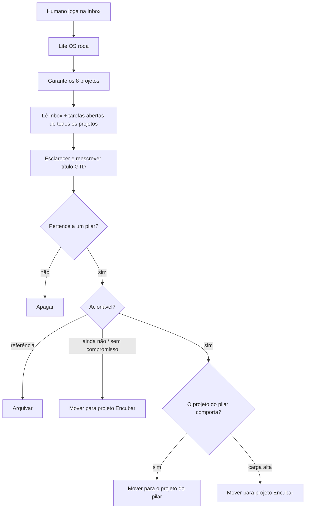

# Spec 01 — Fluxo Todoist

Status: **alinhada** (2026-08-18)  
Código do processador: **depois** desta conta existir.

Captura humana = só a **Inbox do Todoist**.  
O Life OS, ao rodar, **esvazia a Inbox** com GTD: esclarecer → organizar.  
**Não marca Hoje.** Engajar fica para o Watch ou spec futura.

A conta Todoist é alinhada **antes** do código do processador. O processador **pode criar** projeto que ainda não existir.

Conta alinhada em 2026-08-18. IDs atuais:

| Projeto | ID | Papel |
|---|---|---|
| `🩺 Saúde` | `6fGcGJpmjQ49X54h` | Pilar (ex-Vitalidade) |
| `👨 Família` | `6chHqrXV8FjJx259` | Pilar |
| `🏠 Casa` | `6hHw9c6qpHQ9cJr2` | Pilar |
| `💰 Financeiro` | `6hHw9c9559X6x2V8` | Pilar |
| `🤝 Amizades` | `6hHw9cG32h8JxPP6` | Pilar |
| `🕍 Instituto` | `6cfjmmqfhW4282hQ` | Pilar |
| `🌙 Loja Lua Branca` | `6hHw9cMQM8qCCmvv` | Pilar |
| `💤 Encubar` | `6XmPMFCJGMMQQ5x8` | Algum dia talvez (já existia) |

`🏠 Lar` foi partido e apagado. Os sete pilares (exceto Encubar) ficam sob `📁 Projetos`.

---

## 1. Papel

| Camada | Ferramenta | Entra |
|---|---|---|
| Captura | Todoist Inbox | Texto solto. Única porta de entrada. |
| **Ação** | **Projetos dos sete pilares** | Próxima ação física, só se o pilar ainda comporta |
| Algum dia | **Projeto `Encubar`** | Pertence à vida, mas não será pego ainda |
| Relógio | Google Calendar | Contexto de leitura. Sem evento e sem due nesta corrida. |
| Plano | Notion | Fora desta spec |
| Porquê | Vault | Contexto que o LLM pode ler |

O humano **só adiciona na Inbox**. Não escolhe projeto, etiqueta nem data.

TDAH: um inbox. Um destino por item. Sem explodir um texto em cinco tarefas.

---

## 2. Conta

Oito projetos + Inbox nativa. Encubar **é projeto**, não lista e não seção.

| Projeto | Papel |
|---|---|
| `🩺 Saúde` | Pilar |
| `👨 Família` | Pilar |
| `🏠 Casa` | Pilar (manutenção, compras, carros) |
| `💰 Financeiro` | Pilar (contas, dinheiro) |
| `🤝 Amizades` | Pilar |
| `🕍 Instituto` | Pilar |
| `🌙 Loja Lua Branca` | Pilar |
| `💤 Encubar` | **Não é pilar.** Parque de “algum dia talvez” |

**Não é pilar de tarefa:** Engenharia / PagBank. Item de trabalho na Inbox → apagar.

TDAH não é pilar nem projeto.

Se na corrida faltar um projeto da tabela, o processador **cria** (nome + emoji acima). Não cria Engenharia. Não recria o pai `Leandro Budau Moraes`.

---

## 3. Fluxo ao rodar

Um item da Inbox → **um** destino. O LLM **reescreve** o título (§3.3) antes de mover.

### 3.1 Esclarecer

Para cada item, nesta ordem:

1. O que é isto, em uma frase?
2. Pertence a qual pilar da tabela — ou a nenhum?
3. É acionável? Qual é a próxima ação física (GTD)?
4. Um passo ou resultado com vários passos? (vários passos = um item no destino, **não** N cards)
5. **Viabilidade:** ler **tudo** o que já está nos projetos dos pilares. Encubar conta como parque, não como carga de pilar.

Não inventa fato. Dúvida de viabilidade → Encubar, não chute para o pilar.

### 3.2 Organizar (viabilidade)

Fazer sentido ir para um pilar **não basta**. Só move para o projeto do pilar se, perante o que **já existe nesse pilar**, ainda é viável empenhar.

Sinais de “não comporta” (perceptível, sem número mágico):

- O projeto do pilar já tem várias próximas ações abertas.
- Já existe item equivalente.
- O pilar já tem trabalho a meio e somar mais um dilui o foco.
- Carga **geral** dos sete pilares alta — vale inclusive para Amizades.
- Instituto: já há a entrega da semana. Loja: já há o item da quinta.

| Decisão | Destino |
|---|---|
| Nenhum pilar, ruído, PagBank | **Apagar** |
| Pilar, não acionável, referência | `📌 Arquivar` (lista, se existir) |
| Pilar, “algum dia talvez”, sem pegar agora | Projeto `💤 Encubar` |
| Pilar + acionável + **pilar não comporta** | Projeto `💤 Encubar` |
| Pilar + acionável + **pilar comporta** | Projeto do pilar, título reescrito |

`💤 Encubar` é o projeto onde ficam tarefas que **não serão pegas ainda**, porém algum dia talvez. Não é seção dentro do pilar. Não é lista GTD.

Não marcar due. Não promover a Hoje. Item no pilar ou no Encubar fica **sem data**.

### 3.3 Reescrita GTD do título

O texto cru da Inbox não viaja. O LLM reescreve **o mesmo item**:

- Verbo no infinitivo + objeto concreto: o que o corpo faz e quando está **feito**.
- Visível e completable numa sessão (`Ligar para Maria Nilda perguntar avaliação TDAH`, não `Família` nem `Melhorar o instituto`).
- Uma ação. Sem lista, sem 90/5, sem cápsula, sem “organizar a oficina”.
- Resultado vago → só a **primeira** ação física; o resto não vira card.
- Etiqueta, se óbvia, é contexto (`Casa` `Rua` `Celular` `Compra`), nunca o nome do pilar.

### 3.4 O que o processador não faz

- Criar um segundo *item* a partir de um da Inbox (projeto faltando, sim; tarefa extra, não)
- Completar tarefa
- Criar evento no Calendar
- Marcar Hoje / `due`
- Etiquetar por pilar
- Aplicar regra dos 2 minutos
- Partir um item em N tarefas

---

## 4. Engajar (Hoje)

**Fora desta corrida.** Processar Inbox não põe data.

---

## 5. Porta (quando implementar)

| Método | Uso |
|---|---|
| `listTasks` (Inbox + por projeto) | Captura e carga |
| `listProjects` | Resolver / detectar falta |
| `createProject` | Criar pilar ou Encubar se não existir |
| mover / atualizar conteúdo / apagar | Organizar |
| `updateTaskDue` | **Não chama** |
| `completeTask` | **Não chama** |

O domínio não importa o SDK. Testes mockam a porta.

---

## 6. Tensão com o vault

O Second Brain ainda tem seis pilares, outros nomes, sem Amizades / Financeiro. Engenharia continua só no relógio. Alinhar o vault é outra nota — esta spec manda só na conta Todoist.

---

## 7. Fechado

1. Viabilidade olha a carga dos **projetos dos pilares**. Não comporta → Encubar, não forçar o pilar.
2. Esta corrida **não** marca Hoje.
3. Amizades entra, mesma régua de carga.
4. LLM **reescreve** o título (§3.3).
5. Conta alinhada **antes** do código do processador: Saúde, Casa, Financeiro, Encubar, etc.
6. Processador **pode criar** projeto da tabela se faltar.
7. Encubar é **projeto**, não lista e não seção. Guarda o que não será pego ainda, algum dia talvez.

## 8. Preparação da conta

Feito em 2026-08-18: Saúde, Casa, Financeiro, Amizades, Loja Lua Branca, Encubar (já existia). `Lar` partido e removido.

O processador ainda pode **criar** qualquer projeto da tabela se faltar numa corrida futura.
