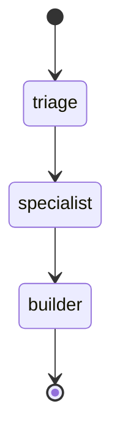
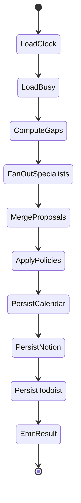
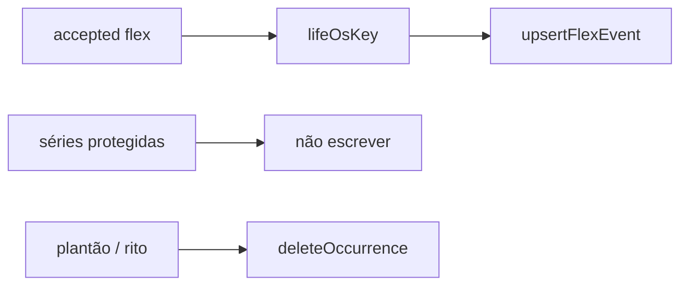

# 02 — Agente Mestre (orquestrador e timeblocking)

**Status:** contrato v0.1 (SDD) · grafo de 3 nós em `LifeOsGraph.ts`; job `src/jobs` ainda não existe  
**Depende de:** [00-architecture-overview.md](./00-architecture-overview.md), [01-api-integrations.md](./01-api-integrations.md)  
**Alimenta:** [03-specialist-agents.md](./03-specialist-agents.md)

O Agente Mestre é o único processo que **escreve no relógio**. Consulta os cinco especialistas em paralelo (nó `specialist`), aplica políticas de conflito e anti-ruído (nó `builder`), e materializa o timeblocking do dia.

Ele **não** é dono de frente. Não prioriza Mim sobre Família “por default”: a grade protegida já decidiu os donos. O Mestre só preenche **gaps** e aplica exceções.

Ciclo como o código executa hoje: [Funcionalidade.md](./Funcionalidade.md).

---

## 1. Responsabilidade (SRP)

| Faz | Não faz |
|---|---|
| Disparar fan-out dos 5 especialistas | Inventar ação GTD |
| Calcular busy + gaps | Dose, laudo, substância (vault clínico) |
| Merge e teto de 3 blocos flex | Segundo item da Loja; segundo bloco Instituto |
| Upsert de ocorrência flex | PATCH de série protegida |
| Daily Plan no Notion | Criar spec de bloco |
| Promover Todoist Hoje (existente) | Completar tarefa |
| Marcar frentes descobertas | Sexto agente PagBank |
| Apagar ocorrência se plantão/rito explícito | Bloquear 24 h de plantão no Calendar |

---

## 2. CRON e janelas

Fuso: `America/Sao_Paulo`.

**No repositório hoje:** `src/run-life.sh` faz `cd` na raiz, carrega o bashrc e chama `npx tsx src/test-run.ts`, redirecionando para `logs/cron.log`. `test-run.ts` instancia o container e chama `executeDailyTriage({ dryRun: false })`. Não há `src/jobs`, não há `node-cron` importado, não há lock file, não há `src/index.ts`. Quem agenda (crontab/systemd) fica fora do git. `LIFE_OS_CRON` **não é lido**.

**Contrato** (quando existir job no repo):

| Job | Expressão | Papel |
|---|---|---|
| `daily` | `20 5 * * *` | Timeblocking de **hoje** antes das 06:00 humanas |
| `evening` | `30 21 * * *` | Opcional v0.2: pré-plano de amanhã. **Fora de v0.1** |
| `weekly` | `0 21 * * 0` | Opcional v0.2: revisão semanal. **Fora de v0.1** |

`LIFE_OS_CRON` sobrescreveria só o job `daily` — ainda não implementado.

Regras:

- 05:20 é máquina, não humano. Nenhum evento começa 05:xx.
- Se a corrida `daily` atrasar e `now() ≥ 06:00`, ainda roda, mas **não** move blocos já em andamento (`start ≤ now`).
- Uma corrida por `date`. Lock file `/tmp/life-os-daily-{date}.lock` (ou flock). Segunda invocação no-op com log.

```typescript
export interface CronJobSpec {
  readonly name: "daily";
  readonly expression: string;
  readonly timezone: "America/Sao_Paulo";
  readonly timeoutMs: 180_000;
}

export const DAILY_JOB: CronJobSpec = {
  name: "daily",
  expression: "20 5 * * *",
  timezone: "America/Sao_Paulo",
  timeoutMs: 180_000,
};
```

---

## 3. Grafo LangGraph

### 3.0 Implementação atual (`LifeOsGraph.ts`)



| Nó | Quem | I/O |
|---|---|---|
| `triage` | LLM + `detectConstraints` + `computeGaps` | Delega Inbox → especialista ou `ignore_pagbank` |
| `specialist` | 5× LLM em paralelo (`SPECIALIST_ORDER`) | `SpecialistOutput[]` |
| `builder` | Políticas determinísticas + LLM só no callout | `plan`, `calendarWrites`, `conflicts`, `todoistTodayIds` |

O Mestre (`MasterAgent.executeDailyTriage`) carrega Todoist/Notion/Calendar **antes** de `graph.invoke`. O grafo não chama portas. Persistência é depois: `upsertFlexEvent` → `upsertDailyPlan` (memória) → `applyKanbanMoves` (memória) → `promoteToToday`.

`listBusy` e `deleteOccurrence` existem na porta e **não** entram nesta corrida. Ocupado = `listProtectedOccurrences`. Plantão/rito preenchem `constraints` e não apagam ocorrência.

### 3.1 Contrato alvo (ainda não é o StateGraph)

O diagrama abaixo permanece o alvo da spec. O código ainda não tem nós `LoadClock`, `LoadBusy`, `PersistCalendar` dentro do grafo.



Nós do **contrato alvo** são funções sobre `OrchestratorState`, com I/O só via portas. O grafo **atual** usa `AgentState` (`inbox`, `projects`, `delegations`, `calendarWrites`, …) e não chama portas — o Mestre já carregou.

Há um tipo extra no código, ausente do contrato de 9 nós:

```typescript
export type TriageTarget =
  | Exclude<AgentId, "mestre">
  | "ignore_pagbank";

export interface Delegation {
  readonly actionId: string;
  readonly agentId: TriageTarget;
  readonly rationale: string;
}
```

```typescript
export interface OrchestratorState {
  readonly date: string;
  readonly now: CivilInstant;
  readonly plantao: boolean;
  readonly ritoNoSabado: boolean;
  readonly occupied: readonly CalendarEventRef[];
  readonly rites: readonly CalendarEventRef[];
  readonly gaps: readonly TimeRange[];
  readonly specialistOutputs: readonly SpecialistOutput[];
  readonly merged: readonly TimeBlockProposal[];
  readonly accepted: readonly TimeBlockProposal[];
  readonly rejected: readonly RejectedProposal[];
  readonly kanbanMoves: readonly KanbanMove[];
  readonly plan: DailyPlan | null;
  readonly writtenEventIds: readonly string[];
  readonly errors: readonly IntegrationError[];
}

export interface RejectedProposal {
  readonly proposal: TimeBlockProposal;
  readonly reason:
    | "protected_overlap"
    | "pagbank_overlap"
    | "sleep_overlap"
    | "lunch_overlap"
    | "noise_cap"
    | "duplicate_front_flex"
    | "loja_second_item"
    | "instituto_second_delivery"
    | "no_physical_action"
    | "past_slot"
    | "schema_invalid";
}
```

Contrato do grafo:

```typescript
export interface IMasterOrchestrator {
  run(date: string): Promise<Result<OrchestratorResult>>;
  executeDailyTriage(options?: {
    readonly dryRun?: boolean;
    readonly date?: string;
  }): Promise<Result<OrchestratorResult>>;
}
```

`run(date)` no código delega para `executeDailyTriage({ date })`. `dryRun: true` loga os writes e não chama as portas de mutação. A entrada `src/test-run.ts` usa `dryRun: false`.

Fan-out: `Promise.all` nos cinco especialistas. Timeout por especialista: 25 s. Falha de um → `uncovered: true` daquela frente, as outras seguem.

---

## 4. Entrada: busy, gaps, restrições

### 4.1 Detectar plantão e rito

```typescript
export interface ConstraintDetector {
  detect(input: {
    date: string;
    occupied: readonly CalendarEventRef[];
    rites: readonly CalendarEventRef[];
  }): SpecialistConstraints;
}
```

Heurística v0.1 (determinística, sem LLM):

- `plantao`: existe evento no ocupado cujo summary contém `plantão` / `plantao` (case insensitive). Flag `LIFE_OS_PLANTAO` **não é lida**. Plantão **não** é série.
- `ritoNoSabado`: `date` é sábado **e** `rites.length > 0` no dia.
- `smileOrConsult`: evento `SAUDE` avulso (não está em `PROTECTED_SERIES_IDS`) sobreposto a 17:30–20:00.

Efeito:

| Flag | Contrato | Código hoje |
|---|---|---|
| `plantao` | Pede `deleteOccurrence` de Zone 2 do dia e Ultra da **noite seguinte** se for ter/qui. Escola **intocada**. | Só preenche `constraints.plantao`. **Não apaga** ocorrência |
| `ritoNoSabado` | Pede `deleteOccurrence` da oficina `jrpcc165gkfi6nqnbb6gsob4uo` naquele sábado. Não cria substituto | Só preenche `constraints.ritoNoSabado` |
| `smileOrConsult` | Não cria flex em cima. Não reabre ocorrência de Família já apagada | Usado nas constraints; overlap com protegido já rejeita flex |

### 4.2 Cálculo de gaps

```typescript
export interface GapCalculator {
  compute(input: {
    date: string;
    occupied: readonly CalendarEventRef[];
    weekday: 0 | 1 | 2 | 3 | 4 | 5 | 6;
  }): readonly TimeRange[];
}
```

Algoritmo:

1. Janela civil do dia: `06:00` → `22:00` (fora = sono, intocável para flex).
2. Subtrair todos os `occupied` opacos.
3. Subtrair PagBank 09:00–12:00 e 13:00–18:00 em dias úteis **mesmo se a série falhar na API** (fallback hardcoded).
4. Subtrair almoço 12:00–13:00 em dias úteis (fallback).
5. Descartar gap `< 25 minutos` (TDAH: não criar microbloco).
6. Sábado: 06:00–09:00 e 12:00–22:00 são candidatos (09:00–12:00 oficina protegida, salvo rito).
7. Domingo: 09:20–22:00 após Ultra.

Gaps típicos em dia útil: `08:20–09:00` (40 min). Esse gap **não** é para engenharia profunda nem para Loja. Pode receber flex de Casa só se for ação `Casa`/`Celular` de ≤ 25 min (ex.: boleto). Default v0.1: **não preencher 08:20–09:00** — café/bloco 03 é Todoist, não evento.

Política v0.1 de preenchimento:

- Dia útil: flex preferencialmente **não** compete com 18:00–20:00 (Família). Exceção: quinta 18:00 já é Loja (protegido).
- Sábado tarde: único gap largo para Casa (`compra` + sair).
- Quarta 20:00: buscar Arthur (Família). Sem Ultra. Sem flex de Instituto.

---

## 5. Consumo dos especialistas

O Mestre monta o mesmo `SpecialistContext` base e **filtra** por frente:

```typescript
export interface SpecialistAgent {
  readonly id: Exclude<AgentId, "mestre">;
  readonly front: FrontId;
  propose(ctx: SpecialistContext): Promise<SpecialistOutput>;
}
```

Filtro obrigatório no Mestre **depois** do retorno (defesa em profundidade):

```typescript
export function assertOwnFront(out: SpecialistOutput): void {
  if (out.proposals.some((p) => p.front !== out.front)) {
    throw new Error(`Especialista ${out.agentId} propôs frente alheia`);
  }
}
```

Proposta com `conflictsWithProtected: true` é morta no merge (o especialista deve marcar; o Mestre recalcula overlap de qualquer forma).

Schema Zod da saída (validação pós-LLM):

```typescript
import { z } from "zod";

export const TimeBlockProposalSchema = z.object({
  agentId: z.enum([
    "pessoal",
    "infraestrutura_casa",
    "profissional_instituto",
    "operacoes_loja_lua_branca",
    "logistica_familiar",
  ]),
  front: z.enum(["mim", "casa", "instituto", "loja_lua_branca", "familia"]),
  prefix: z.enum(["SAUDE", "LAR", "INSTITUTO", "LOJA", "FAMILIA"]),
  title: z.string().min(3).max(64),
  range: z.object({
    start: z.object({ iso: z.string() }),
    end: z.object({ iso: z.string() }),
  }),
  kind: z.enum([
    "protected_series",
    "exception_occurrence",
    "flex_timeblock",
    "travel_buffer",
  ]),
  gtdActionId: z.string().nullable(),
  cue: z.string().min(1).max(140),
  energy: z.enum(["alta", "media", "baixa"]),
  priority: z.union([z.literal(0), z.literal(1), z.literal(2), z.literal(3)]),
  conflictsWithProtected: z.boolean(),
  rationale: z.string().max(280),
});
```

`kind: "protected_series"` na boca do especialista = **ignorado** (especialista não “repropõe” Sono/Ultra). Só `flex_timeblock` entra no teto.

---

## 6. Merge e resolução de conflito

Ordem determinística (sem LLM neste nó):

```
1. Descartar schema_invalid, past_slot, no_physical_action (flex sem gtdActionId)
2. Descartar overlap com occupied opaco (protected_overlap)
3. Descartar overlap PagBank / sono / almoço
4. Loja: no máximo 1 flex no dia e somente se weekday === 4 (quinta)
   e range ⊆ 18:00–19:00 — na prática a série já cobre; flex extra = loja_second_item
5. Instituto: no máximo 1 flex, somente sábado, range ⊆ 09:00–12:00
   — série já cobre; flex extra = instituto_second_delivery
6. Família: flex não invade 06:00–07:45 nem escola
7. Mim: flex não move Ultra / Zone 2 / sono
8. Ranking dos flex restantes:
     priority ASC (0 = mais urgente), depois duração menor, depois FrontOrder
9. Teto: 3 flex no dia (noise_cap)
10. No máximo 1 flex por frente por dia (duplicate_front_flex)
```

`FrontOrder` (desempate, não prioridade moral):

```typescript
export const FRONT_TIEBREAK: readonly FrontId[] = [
  "familia",
  "mim",
  "casa",
  "instituto",
  "loja_lua_branca",
];
```

Família ganha desempate porque TDAH no convívio é restrição: não se “encaixa um boleto” em cima do Arthur.

Sobreposição entre dois flex aceitos: o de pior rank é rejeitado (`protected_overlap` não — usar `duplicate_front_flex` ou recorte). v0.1 **não recorta** horários; rejeita o inteiro.

```typescript
export interface PolicyEngine {
  apply(input: {
    occupied: readonly CalendarEventRef[];
    gaps: readonly TimeRange[];
    outputs: readonly SpecialistOutput[];
    weekday: 0 | 1 | 2 | 3 | 4 | 5 | 6;
    now: CivilInstant;
  }): {
    accepted: readonly TimeBlockProposal[];
    rejected: readonly RejectedProposal[];
    kanbanMoves: readonly KanbanMove[];
    uncoveredFronts: readonly FrontId[];
  };
}
```

Frente descoberta: especialista `uncovered: true` **ou** zero presença no dia (nem protegido nem flex). PagBank não conta como frente.

Presença por frente no dia útil típico (não descoberta):

| Frente | Cobertura mínima |
|---|---|
| Mim | Sono + almoço + Zone 2 (seg–sex) e/ou Ultra (ter/qui/dom) |
| Família | Casa 06:00 + escola (seg–sex) + 18:00 (seg/ter/qua/sex) |
| Casa | Compartilha 18:00; sábado tarde é o slot próprio. Dia útil sem flex Casa **não** marca descoberta |
| Instituto | Só sábado. Dia útil = N/A (não listar como descoberta) |
| Loja Lua Branca | Só quinta 18:00. Outros dias = N/A |

---

## 7. Timeblocking — o que é escrito



Cue do flex (Mestre monta, não o LLM):

1. Se `proposal.spec` existe, cue = spec.cue (já 1 linha).
2. Senão cue = `proposal.cue` truncado a 140 chars, uma linha, sem markdown.
3. Título = `{prefix} - {title sem prefixo}`.

`lifeOsKey = lifeos:{date}:{front}:{gtdActionId}`.

Kanban: todo flex aceito gera `KanbanMove` `next → timeblocked` se houver card; senão o Daily Plan lista a ação sem card novo.

Todoist: `promoteToToday` para a união de `todoistTodayIds` com `accepted.gtdActionId`, **menos** itens `ignore_pagbank`. Só roda se todos os `upsertFlexEvent` da corrida tiverem ok. Especialista não promove sozinho.

---

## 8. Prompt de sistema do Mestre

Há **dois** usos de LLM no Mestre, nenhum escolhe horário.

### 8.1 Nó `triage` (`TRIAGE_SYSTEM_PROMPT`)

```
Você é o Agente Mestre do Life OS do Leandro.

Missão neste nó: ler a Inbox GTD e DELEGAR cada item para no máximo um especialista, ou marcar ignore_pagbank.

Cinco especialistas (e só esses):
- pessoal → frente Mim (saúde, treino, academia, M3Gym, Ultra, Zone 2)
- infraestrutura_casa → frente Casa (compras que exigem sair, contas, manutenção)
- profissional_instituto → frente Instituto (oficina sábado, uma entrega)
- operacoes_loja_lua_branca → frente Loja Lua Branca (um item com Caroline, quinta 18:00)
- logistica_familiar → frente Família (Arthur, escola, presença, Caroline como família)

PagBank / Engenharia NÃO é agente. É restrição de relógio (09:00–18:00 em dia útil).
Se o item for trabalho corporativo (bug, conciliação, recebíveis, PR, PagBank, engenharia),
agentId = "ignore_pagbank". Não invente um sexto agente.

Item com dois donos (ex.: evento da Caroline): escolha UM especialista — Loja se for operação/propaganda da loja; Família se for logística de presença. Não duplique.

Português do Brasil. Sem empolgação.
```

### 8.2 Callout do Daily Plan (`MASTER_CALLOUT_PROMPT`)

O nó `builder` aplica políticas de forma determinística. O LLM **só** escreve a frase do callout, temperatura 0.

```
Você é o Agente Mestre do Life OS do Leandro.

Escreva UMA frase (≤ 140 caracteres) para o callout do plano do dia.
A frase é o primeiro movimento humano após as 06:00, não um resumo de carreira.

Regras:
- Português do Brasil, segunda pessoa, concreto.
- Não mencionar PagBank, promoção, inglês, IMAO, dose, cápsula.
- Não inventar compromisso que não esteja em ACCEPTED_BLOCKS.
- Se plantão: lembrar escola 07:15 e que Zone 2 cai.
- TDAH: zero empolgação, zero lista.

ACCEPTED_BLOCKS: {json}
CONSTRAINTS: {json}
```

Saída: `{ "callout": string }` validado por Zod. Falha → callout fallback: `Todoist «Ao acordar». Sair ~07:00 com o Arthur.`

---

## 9. Persistência — ordem e rollback

Ordem no `MasterAgent` hoje:

1. Calendar flex upserts (N ≤ 3) — API real.
2. Notion `upsertDailyPlan` + `applyKanbanMoves` — **mapa em memória**.
3. Todoist `promoteToToday` — só se todos os upserts de Calendar da corrida tiverem ok.

`deleteOccurrence` está no contrato e no adaptador; o Mestre **não chama** neste passo (passo 2 do contrato abaixo).

Contrato (quando as flags plantão/rito apagarem ocorrência):

1. Calendar flex upserts (N ≤ 3).
2. Calendar deleteOccurrence (0–N, só flags).
3. Notion `upsertDailyPlan` + `applyKanbanMoves`.
4. Todoist `promoteToToday`.

Não há transação distribuída. Compensação v0.1:

- Se Calendar ok e Notion falha: resultado com `partial: true`; **não** apaga os flex. Retry no próximo CRON é idempotente via `lifeOsKey`.
- Se Calendar falha em algum flex: não promove Todoist; anota `todoist_skipped: Calendar parcial`.
- Nunca compensar com delete de série.

`OrchestratorResult` (kernel, spec 00) já inclui `rejected` e `partial`.

---

## 10. Prompt interno / ferramentas do grafo

Ferramentas (LangGraph nodes, não function-calling livre para o LLM de políticas):

| Node | No código | Side effect |
|---|---|---|
| `triage` | LLM + gaps + constraints | não |
| `specialist` | 5× prompt em `specialist-prompts.ts` | não |
| `builder` | `applyPolicies` + callout LLM | não |
| Persistência | **fora** do grafo, em `MasterAgent` | Calendar upsert; Notion memória; Todoist promote |
| `deleteOccurrence` | adaptador existe | **não chamado** |

O LLM dos especialistas **não** tem tools de leitura — o Mestre já injetou ações, specs, occupied e gaps no prompt. O LLM do Mestre no `builder` **não** tem tools de write (só o callout).

---

## 11. Regras invioláveis (checklist do implementador)

1. `assertNotProtectedWrite` em todo write.
2. PagBank hardcoded se a API não devolver as séries.
3. Teto 3 flex.
4. Loja: zero flex fora da quinta; zero segundo item.
5. Instituto: zero flex fora do sábado; zero segunda entrega.
6. Não acordar 05:xx no Calendar.
7. Almoço intocável.
8. Cue de manhã autossuficiente — o Mestre não coloca “abrir Notion” em Casa/Escola/Zone 2.
9. Idioma: identificadores em inglês; textos de usuário em pt-BR.

---

## 12. Exemplo de corrida (terça sem plantão)

Ocupado protegido: Casa, Escola, Zone 2, PagBank ×2, Almoço, Família 18:00–20:00, Ultra 20:00–21:15, Sono.

Gaps reais: 08:20–09:00 (não preencher), e nenhum gap noturno.

Especialistas:

- Pessoal: zero flex (rotina já no Todoist + Ultra protegida).
- Casa: propõe “Pagar luz” 08:25–08:50 → **rejeitado** (política: não preencher 08:20–09:00) **ou** aceito se `priority === 0` e contexto `Celular`. v0.1 default = rejeitar (`noise_cap` / gap policy). Implementação deve documentar a escolha no `rejected.reason`.
- Instituto: `uncovered` N/A (não sábado).
- Loja: N/A (não quinta).
- Família: zero flex.

Daily Plan: callout de Casa/Arthur. Frentes N/A não listadas. Casa não é descoberta.

Sábado sem rito: Instituto cobre com série + 1 entrega Todoist promovida. Casa pode ganhar **um** flex 14:00–16:00 se houver `compra` no projeto Lar.

---

## 13. Critério de aceite desta spec

1. Job 05:20 no fuso correto; lock impede duplicata. *(lock e `src/jobs` ainda não existem; o wrapper é `src/run-life.sh`.)*
2. Falha do especialista Loja não impede Família.
3. Proposta que cruza 13:00–18:00 em dia útil nunca é escrita.
4. Dois CRON no mesmo dia não duplicam evento (`lifeOsKey`).
5. Sábado com rito: oficina tem ocorrência removida; sem flex Instituto substituto. *(delete ainda não é chamado pelo Mestre.)*
6. Callout do Notion ≤ 140 chars e não cita dose.
7. Grafo sem aresta de especialista → Calendar port.
