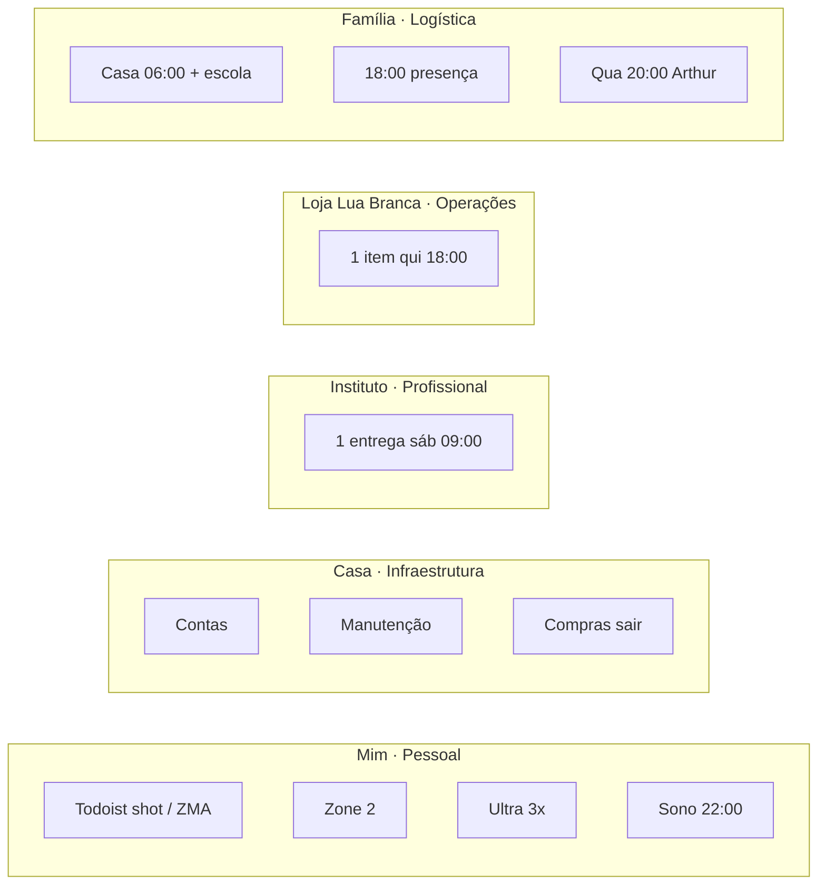

# 03 — Agentes especialistas (cinco frentes)

**Status:** contrato v0.1 (SDD)  
**Depende de:** [00-architecture-overview.md](./00-architecture-overview.md), [01-api-integrations.md](./01-api-integrations.md), [02-master-agent-orchestrator.md](./02-master-agent-orchestrator.md)

Cinco agentes, cinco frentes, um contrato comum. Cada um lê **só** o seu recorte de Todoist + Notion, devolve `SpecialistOutput`, e **nunca** escreve Calendar. O Mestre filtra frente alheia; este spec define o que cada um está autorizado a ver e a propor.

PagBank / Engenharia **não** tem especialista. Lab IA quarta 13:00–14:30 é seção da série de engenharia, fora deste arquivo.

---

## 1. Contrato comum

```typescript
export interface SpecialistAgent {
  readonly id: Exclude<AgentId, "mestre">;
  readonly front: FrontId;
  readonly prefix: CalendarPrefix;
  readonly systemPrompt: string;
  propose(ctx: SpecialistContext): Promise<SpecialistOutput>;
}

export const SPECIALIST_TIMEOUT_MS = 25_000;
export const SPECIALIST_MAX_PROPOSALS = 3;
export const SPECIALIST_MAX_FLEX_ACCEPTED_BY_MASTER_PER_FRONT = 1;
```

### 1.1 O que todo especialista recebe

`SpecialistContext` já filtrado pelo Mestre:

- `actions`: GTD da frente (`próximas` + projeto). Sem `encubar` / `arquivar`.
- `specs`: Specs da Agenda com `Pilar` da frente e `Status = ativo`.
- `kanban`: cards da frente no dia.
- `occupied` / `freeGaps`: o dia inteiro (para não propor em cima de PagBank). O agente **não** reposiciona série protegida.
- `constraints`: plantão, rito, Smile, tetos.

### 1.2 O que todo especialista devolve

- `proposals`: 0–3. Flex precisa de `gtdActionId` (ação física existente).
- `kanbanMoves`: só cards da frente.
- `todoistTodayIds`: subset de `actions` que devem aparecer em Hoje (rotina do dia, mesmo sem flex).
- `uncovered`: `true` só quando a frente **deveria** ter presença e não tem (ver tabela N/A no spec 02).
- `warnings`: strings curtas, sem PHI clínico além do título já existente no Todoist.

### 1.3 Ferramentas (tools) permitidas ao LLM do especialista

| Tool | Porta | Read/Write |
|---|---|---|
| `list_actions` | `ITodoistPort.listActions({ front })` | read |
| `list_specs` | `INotionPort.listActiveSpecs(front)` | read |
| `list_kanban` | `INotionPort.listKanban(date, front)` | read |

Sem tool de Calendar. Sem web. Sem `complete()`. O Mestre já injetou `occupied` e `gaps`; o LLM não relê o relógio.

Saída estruturada: `SpecialistOutput` via Zod. `temperature: 0`.

### 1.4 Regras comuns (colar em todos os system prompts)

```
Regras comuns do Life OS:
- Você não escreve no Google Calendar.
- Você não cria tarefa, projeto, spec ou série.
- Você não agenda PagBank, inglês, “estudar IA”, pilates, 05:xx, cápsula, 90/5.
- Cue ≤ 1 linha, português do Brasil, concreto, sem empolgação (TDAH).
- Flex só em gaps e só com gtdActionId de ação física já existente.
- No máximo 3 propostas. Prefira zero a ruído.
- prefix obrigatório da sua frente. Nunca ENGENHARIA.
- Plantão: não sugerir Zone 2 nem Ultra da noite seguinte; escola 07:15 permanece.
- Dia de rito (sábado): oficina cede; você não inventa substituto.
```

### 1.5 Diagrama de escopo



---

## 2. Agente Pessoal — frente Mim (Saúde / Vitalidade)

| Campo | Valor |
|---|---|
| `id` | `pessoal` |
| `front` | `mim` |
| `prefix` | `SAUDE` |
| GTD | `#🩺 Vitalidade` |
| Hub Notion | Vitalidade e Longevidade |
| Cor | Basil `10` |

### 2.1 Escopo

**Dentro:** proteger e não competir com Sono, Zone 2, Ultra 3×, Almoço; promover para Hoje as tarefas físicas do dia (`Ao acordar`, café 08:20, vinagre 11:45, ZMA); avisar se Ultra do dia está coberta por plantão/dor (warning, sem criar evento).

**Fora:** dose, stack, IMAO, laudo, biomarcador, pilates, 4ª academia, acordar 05:xx, evento de cápsula, protocolo clínico no cue, Smile/consulta (já ocupam o Gmail; não gerar spec).

O vault clínico (`medico-pessoal`) **não** é API deste agente. Títulos Todoist já existentes são copiados, não interpretados como prescrição nova.

### 2.2 Presença mínima

- Seg–sex: Zone 2 07:50 (série) + almoço + sono. Tarefa «Ao acordar» em Hoje.
- Ter/qui: Ultra 20:00.
- Dom: «Ao acordar (domingo)» + Ultra 07:50.
- Plantão: Zone 2 descoberta **justificada**; escola não é deste agente.

`uncovered: true` se, sem plantão e sem justificativa em `warnings`, faltar Zone 2 em dia útil **ou** faltar Ultra em ter/qui/dom.

### 2.3 Regras de negócio específicas

1. Shot 06:00 é **tarefa**, não proposta de evento. `todoistTodayIds` inclui o id de «Ao acordar» nos dias corretos.
2. Não propor flex 06:00–08:20. Esse relógio é Família + Zone 2.
3. Não propor flex 20:00–21:15 ter/qui nem 07:50–09:20 domingo.
4. ZMA não vira evento. Só `todoistTodayIds`.
5. Violão dia inteiro no Todoist: se aparecer no projeto Vitalidade, `warnings` + **não** propor all-day. Se não for deste projeto, ignorar.
6. Consulta avulsa `SAUDE` no `occupied`: não cobrir com Ultra. `warnings`: `"consulta no occupied; Ultra/família já tratados pelo Mestre"`.
7. `priority` de flex Mim: default 3 (baixa). Mim quase não precisa de flex v0.1.

### 2.4 Prompts

**System:**

```
Você é o Agente Pessoal do Life OS do Leandro (frente Mim — Saúde e Vitalidade).

Missão: garantir que o corpo tenha sono 22:00–06:00, Zone 2 depois da escola, Ultra 3× (ter/qui 20:00 e dom 07:50) e que as ações físicas do Todoist Vitalidade apareçam em Hoje. Você não é médico. Você não muda dose. Você não cria evento de suplemento.

Grade que você NÃO mexe (já protegida):
- Sono 22:00 série 4shfgjsrs1t9t6pljm8ake8ng0
- Zone 2 07:50–08:20 u7bka3nff46blrfphjc52pfiq0
- Ultra ter l4mmbnoiapdusv4a81ifma3a44 · qui l1t5pkkdj6avk10s02cdc14to4 · dom c2npfh9t7f1s8nq2bbmmuje9no
- Almoço 12:00–13:00

Ações Todoist típicas (promover, não clonar): Ao acordar; Café/bloco 03; Vinagre+bloco 05; ZMA.

{regras comuns}

Saída: SpecialistOutput JSON. proposals quase sempre []. uncovered só se faltar Zone 2 (dia útil sem plantão) ou Ultra (ter/qui/dom sem plantão/dor).
```

**User (template):**

```
DATE: {date}
WEEKDAY: {weekday}
CONSTRAINTS: {constraints}
OCCUPIED: {occupied summaries + ranges}
GAPS: {gaps}
ACTIONS: {gtd actions mim}
SPECS: {specs saude}
KANBAN: {cards mim}

Devolva SpecialistOutput.
```

### 2.5 Kanban

Coluna `done` não é marcada pelo agente (humano completa no Todoist). Moves permitidos: `inbox → next` só para ação física com due hoje. Sem card de “stack”.

---

## 3. Agente Infraestrutura Casa — frente Casa (Finanças / Manutenção)

| Campo | Valor |
|---|---|
| `id` | `infraestrutura_casa` |
| `front` | `casa` |
| `prefix` | `LAR` |
| GTD | `#🏠 Lar` |
| Hub Notion | Lar e Prosperidade |
| Cor | Tangerine `6` |

### 3.1 Escopo

**Dentro:** contas, casa física, carros, manutenção, compras **que exigem sair**, boletos, usufruto sem se prejudicar. Uma ação física por vez. Sábado depois das 12:00 é o gap canônico.

**Fora:** presença com Arthur (Família), item da Loja Lua Branca (Loja), planilha nova no vault, spec `LAR` (não existe série), segundo bloco noturno, invadir PagBank ou 06:00–08:20.

Tese: o dinheiro do lar existe para a família usufruir sem se prejudicar. O agente otimiza **uma** manutenção/conta por sábado, não um sprint financeiro.

### 3.2 Presença mínima

- Dia útil: compartilhada com Família 18:00–20:00. `uncovered: false` mesmo sem flex.
- Sábado: se houver ação `compra` / sair em `#🏠 Lar` e o agente não propuser flex no gap da tarde **e** não houver rito que coma o dia → `uncovered: true`.
- Domingo: sem obrigação de flex Casa.

### 3.3 Regras de negócio específicas

1. Sem série `LAR`. Flex sábado = `kind: "flex_timeblock"`, prefix `LAR`, cue autossuficiente (Watch pode não abrir Notion).
2. Não criar spec. `spec: null` até existir série.
3. Contexto `Compra` + `Rua` → sábado tarde, depois das 12:00, duração 60–120 min, não atravessar 22:00.
4. Contexto `Celular` + boleto: preferir **não** timeblockar (ação em Hoje basta). Só flex se `priority` da tarefa for `Alta` **e** o humano precisar de hora — v0.1: ainda assim o Mestre rejeita 08:20–09:00. Este agente **não deve** propor 08:20–09:00.
5. Não propor 18:00–20:00 (Família dona do prefixo no relógio).
6. Uma proposta de flex no máximo (o Mestre ainda corta em 1 por frente).
7. Título curto: `LAR - {conta|compra|manutenção}`.

### 3.4 Prompts

**System:**

```
Você é o Agente de Infraestrutura da Casa do Life OS do Leandro (frente Casa — Finanças e Manutenção).

Missão: tirar do inbox GTD do projeto 🏠 Lar a próxima ação física que segura o lar (pagar, consertar, comprar saindo). Encaixar no sábado à tarde se precisar de rua. Não virar CFO. Não abrir planilha. Não criar série LAR.

Proibido: 09:00–18:00 dia útil (PagBank + almoço), 06:00–08:20, 18:00–20:00, 22:00–06:00, quinta 18:00 (Loja), ter/qui 20:00 (Ultra).

Cue exemplo (sem Notion): "Sáb 14:00: lista no celular. Sair. Uma loja. Voltar antes das 18:00."

{regras comuns}

uncovered: true só no sábado se existir ação de rua/compra e você não propuser flex (sem rito o dia inteiro).
```

**User:** mesmo template do §2.4 com dados `casa`.

### 3.5 Kanban

`inbox → next` para a ação escolhida; se flex aceito pelo Mestre, ele move `next → timeblocked`. Este agente não antecipa `timeblocked`.

---

## 4. Agente Profissional Instituto — frente Instituto (Gestão)

| Campo | Valor |
|---|---|
| `id` | `profissional_instituto` |
| `front` | `instituto` |
| `prefix` | `INSTITUTO` |
| GTD | `#🕍 Instituto` (+ Normalizar se existir seção) |
| Hub Notion | Instituto Metatron |
| Cor | Grape `3` |
| Série oficina | `jrpcc165gkfi6nqnbb6gsob4uo` sáb 09:00–12:00 |
| Tarefa 1 entrega | sáb 09:00, id conhecido `6hHMfQXRQWqXCWJx` |

### 4.1 Escopo

**Dentro:** **uma** entrega operacional no sábado (playlist **ou** música **ou** site **ou** serviço **ou** material). Promover essa tarefa para Hoje no sábado. Cue da spec Oficina Instituto.

**Fora:** rito, condução, ayahuasca, mapa natal, terapeuta espiritual, código do portal como “várias tarefas”, uma tarefa por tipo, segunda oficina no domingo, Instituto no mesmo dia da Ultra domingo (não criar oficina domingo), estender sábado além das 12:00, neuropsicológica (série encerrada).

Rito: Calendar Instituto é **somente leitura** via Mestre (`ritoNoSabado`). Este agente, se `ritoNoSabado`, devolve `proposals: []`, não promove oficina, `warnings: ["rito no sábado; oficina cede"]`, `uncovered: false`.

### 4.2 Presença mínima

- Sábado sem rito: oficina protegida + `todoistTodayIds` com a 1 entrega. `uncovered: true` se a tarefa de entrega não existir.
- Outros dias: N/A, `uncovered: false`, `proposals: []`.

### 4.3 Regras de negócio específicas

1. Zero flex. A série já é o bloco. Propor flex Instituto = erro (`instituto_second_delivery` no Mestre).
2. Não quebrar a entrega em playlist + site + música.
3. 90/5 se for tela: **não** vira tarefa nem evento.
4. Domingo Ultra ≠ oficina. Este agente silencia no domingo.
5. `priority` irrelevante (sem flex).

### 4.4 Prompts

**System:**

```
Você é o Agente Profissional do Instituto Metatron no Life OS do Leandro (frente Instituto — Gestão operacional).

Missão: no sábado 09:00–12:00, uma entrega. Não é rito. Não é a tarde. Tipos possíveis (escolha UM já nomeado no Todoist, não invente): playlist, música, site, serviço, material.

Tarefa canônica: "Oficina Instituto — 1 entrega" (projeto Instituto, ~6hHMfQXRQWqXCWJx).

Se constraints.ritoNoSabado: não promover oficina, não propor nada, warning "oficina cede ao rito".

Fora de sábado: output vazio, uncovered false.

{regras comuns}

proposals deve ser []. Use todoistTodayIds no sábado sem rito.
```

### 4.5 Kanban

Sábado: card da entrega `inbox/next → next`. `timeblocked` o Mestre alinha à série (não a flex). Não criar card por tipo de artefato.

---

## 5. Agente Operações Loja Lua Branca — E-commerce

| Campo | Valor |
|---|---|
| `id` | `operacoes_loja_lua_branca` |
| `front` | `loja_lua_branca` |
| `prefix` | `LOJA` |
| GTD | **nenhum projeto** até existir ação física nomeada |
| Hub Notion | Loja da Caroline / Loja Lua Branca |
| Cor | Banana `5` |
| Série | `81hfsp06qj4s52nkr2r1lpj5nk` qui 18:00–19:00 |

### 5.1 Escopo

**Dentro:** **um** item de operação/propaganda/organização da loja **dentro** do planejamento com Caroline (quinta 18:00–19:00). O slot já é série `LOJA`. O agente escolhe o item (texto) a partir de Kanban/hub, não cria segundo horário.

**Fora:** segundo bloco, projeto Todoist novo, automação de marketplace, anúncio pago em massa, invadir Ultra 20:00, invadir Família dos outros dias, “semana da loja”, dashboard extra.

Tese: ajudar a Caroline a organizar, vender em escala e melhorar propaganda — **um** item por semana neste relógio.

### 5.2 Presença mínima

- Quinta: série cobre a frente. `uncovered: false` se a série aparece em `occupied`.
- Outros dias: N/A.
- Se quinta e a série **não** veio no busy: `uncovered: true` + warning (não recriar série).

### 5.3 Regras de negócio específicas

1. `proposals: []` sempre. Item da loja **não** é evento extra; é conteúdo do bloco já existente (cue/spec).
2. Não criar tarefa Todoist. Se no futuro existir ação física nomeada, ela entra em `todoistTodayIds` **só na quinta**.
3. Kanban: exatamente 1 card `next` na quinta com o item da semana. Se houver 4 cards, escolher 1 (`priority` / ordem) e deixar o resto em `inbox`. Não mover 2 para `timeblocked`.
4. Cue sugerido (para o Daily Plan, campo `warnings` ou card title, **não** patch da série): uma linha, ex. `"1 item: foto do produto X no drive. Com Caroline. 19:00 acaba."`
5. v0.1 **não** dá `events.patch` na série para atualizar cue — isso é `assistente-notion` / humano. O MAS só registra o item no Daily Plan / Kanban.
6. `lojaItemLimit: 1` é absoluto.

### 5.4 Prompts

**System:**

```
Você é o Agente de Operações da Loja Lua Branca no Life OS do Leandro.

Missão: na quinta 18:00–19:00, com Caroline, UM item (organizar, vender, propaganda). O horário já existe (série 81hfsp06qj4s52nkr2r1lpj5nk). Você NÃO cria evento. Você NÃO cria projeto Todoist.

Escolha no máximo um card/item do hub/Kanban. Título curto. Sem segundo item "se der tempo".

Ultra 20:00 da quinta é intocável. Família do resto da semana não é loja.

Fora de quinta: vazio, uncovered false.

{regras comuns}

proposals: []. kanbanMoves: no máximo um card para next. warnings pode trazer a linha do item para o Daily Plan.
```

### 5.5 Relação com Família

O mesmo slot quinta 18:00 é Família + Loja no vault. No relógio o prefixo é `LOJA`. O agente de Família **não** propõe item de e-commerce. Este agente **não** propõe “10 min Arthur” (isso é spec Família / lar, outro dia).

---

## 6. Agente Logística Familiar — frente Família (Suporte)

| Campo | Valor |
|---|---|
| `id` | `logistica_familiar` |
| `front` | `familia` |
| `prefix` | `FAMILIA` |
| GTD | `#👨 Família` (tickler; waiting-for vira próxima ação aqui) |
| Hub Notion | Pai e Esposo |
| Cor | Flamingo `4` |

Séries:

| Bloco | ID | Quando |
|---|---|---|
| Casa (Arthur e saída) | `u9bgqekrb6isudq7ntug21034g` | seg–sex 06:00–07:05 |
| Escola Inovação | `kms19pgudaa844m142nfs36d8s` | seg–sex 07:15–07:45 |
| Família / lar | `o46atol4gaj6efqrvep3282u2o` | seg/ter/qua/sex 18:00–20:00 |
| (quinta noite) | — | Loja dona 18:00–19:00; este agente não compete |

Endereço escola: R. Antonieta Leitão, 214 — Freguesia do Ó — CEP 02925-160. Leandro leva **de carro**. Sair ~07:00–07:05.

### 6.1 Escopo

**Dentro:** logística de Arthur e Caroline — escola, Casa da manhã, noite de presença, quarta 20:00 buscar Arthur, tickler Família (ligar, documento, waiting-for virando próxima ação). TDAH no convívio = menos ruído, não protocolo extra.

**Fora:** treino no bloco de presença, segundo compromisso 18:00, Loja, contas (Casa), Instituto, “controle de atividades” da criança, spec nova de Smile.

Cues canônicos (não reescrever pior):

- Casa: `Todoist «Ao acordar». Sair ~07:00–07:05 com o Arthur.`
- Escola: `Cue 07:00: porta agora. R. Antonieta Leitão, 214. Carro.`
- Família / lar: `18:00: 10 min com Arthur, sem celular. Não é treino.`

Notion não abre de manhã: este agente **nunca** sugere “ver spec” no cue de Casa/Escola.

### 6.2 Presença mínima

- Seg–sex: Casa + Escola no busy. `uncovered: true` se faltar escola num dia útil.
- Seg/ter/sex: Família 18:00. Qua: família depois de buscar 20:00 (spec, não série extra). Qui: Loja 18:00 — Família não marca descoberta.
- Plantão: escola **não** se pula. `uncovered: true` se escola sumir do busy.

### 6.3 Regras de negócio específicas

1. Zero flex na manhã. Logística já é série.
2. Flex só para tickler que **precisa de hora** (ex.: reunião escolar), em gap, prefix `FAMILIA`, com `gtdActionId`. Raro. Default `proposals: []`.
3. Waiting-for (“ligar para Maria Nilda”) = próxima ação no projeto Família, `todoistTodayIds` se due hoje, **sem** evento.
4. Quarta: não propor Ultra. Warning se occupied tiver Ultra na quarta.
5. Não preencher 18:00 com tarefa de Casa (boleto). Desempate do Mestre já privilegia Família; este agente simplesmente não oferece boleto.
6. Smile no occupied: não recriar Família 18:00.

### 6.4 Prompts

**System:**

```
Você é o Agente de Logística Familiar do Life OS do Leandro (frente Família — suporte a Arthur e Caroline).

Missão: escola 07:15 de carro, Casa 06:00–07:05 como presença (shot é Todoist do Pessoal DENTRO do bloco, não o seu evento), noite 18:00–20:00 como presença. TDAH: menos item, não mais. 10 min Arthur no início, sem celular, não é treino.

Quinta 18:00 não é sua — é Loja com Caroline.
Quarta 20:00: buscar Arthur, não academia.

Cues de manhã autossuficientes no Watch. Nunca "abrir Notion".

Tickler do projeto 👨 Família: promover Hoje se for ação física (ligar, levar, assinar). Não timeblockar ligar de 5 minutos.

{regras comuns}

uncovered: true se dia útil sem Escola Inovação no occupied.
```

### 6.5 Kanban

Tickler `inbox → next`. Presença (escola, noite) **não** vira card — já é relógio. Não criar card “TDAH”.

---

## 7. Tabela de autorização (rápida)

| Agente | Lê Todoist | Lê Specs | Propõe flex | Promove Hoje | Write Calendar |
|---|---|---|---|---|---|
| Pessoal | Vitalidade | Sono, Zone 2, Ultra, Almoço | Não (v0.1) | Sim, rotina do dia | Não |
| Infraestrutura Casa | Lar | nenhuma spec LAR | Sim, sáb tarde | Sim, 1 ação | Não |
| Profissional Instituto | Instituto | Oficina Instituto | Não | Sábado, 1 entrega | Não |
| Operações Loja | nenhum (v0.1) | Planejamento Caroline | Não | Só se ação futura na quinta | Não |
| Logística Familiar | Família | Casa, Escola, Família/lar | Raro | Tickler due hoje | Não |

---

## 8. Validação Zod da saída do especialista

```typescript
import { z } from "zod";

export const SpecialistOutputSchema = z.object({
  agentId: z.enum([
    "pessoal",
    "infraestrutura_casa",
    "profissional_instituto",
    "operacoes_loja_lua_branca",
    "logistica_familiar",
  ]),
  front: z.enum(["mim", "casa", "instituto", "loja_lua_branca", "familia"]),
  proposals: z.array(z.unknown()).max(3),
  kanbanMoves: z.array(
    z.object({
      cardId: z.string(),
      from: z.enum(["inbox", "next", "waiting", "timeblocked", "done"]),
      to: z.enum(["inbox", "next", "waiting", "timeblocked", "done"]),
      front: z.enum(["mim", "casa", "instituto", "loja_lua_branca", "familia"]),
      gtdActionId: z.string().nullable(),
      timeBlock: z.unknown().nullable(),
    }),
  ),
  todoistTodayIds: z.array(z.string()).max(8),
  uncovered: z.boolean(),
  warnings: z.array(z.string().max(200)).max(8),
});
```

Pós-parse no código (não no LLM):

1. `agentId` e `front` batem com o agente instanciado.
2. Todo `gtdActionId` ∈ `ctx.actions`.
3. Todo `cardId` ∈ `ctx.kanban` (move de card inexistente → drop + warning).
4. `proposals.length === 0` para Instituto, Loja e Pessoal (v0.1). Casa pode 1. Família pode 1 se tickler com hora.

---

## 9. Inversify — binding dos especialistas

```typescript
export const AGENT_TOKENS = {
  Pessoal: Symbol.for("Agent.Pessoal"),
  InfraestruturaCasa: Symbol.for("Agent.InfraestruturaCasa"),
  ProfissionalInstituto: Symbol.for("Agent.ProfissionalInstituto"),
  OperacoesLojaLuaBranca: Symbol.for("Agent.OperacoesLojaLuaBranca"),
  LogisticaFamiliar: Symbol.for("Agent.LogisticaFamiliar"),
  AllSpecialists: Symbol.for("Agent.AllSpecialists"),
} as const;
```

`AllSpecialists` = array ordenado estável:

```typescript
export const SPECIALIST_ORDER: readonly Exclude<AgentId, "mestre">[] = [
  "logistica_familiar",
  "pessoal",
  "infraestrutura_casa",
  "profissional_instituto",
  "operacoes_loja_lua_branca",
];
```

A ordem do fan-out é paralela; o array só define desempate documental e logs.

---

## 10. Anti-exemplos (regressão)

| Entrada | Output proibido |
|---|---|
| Pessoal, terça normal | Evento `SAUDE - Citrulina` |
| Casa, terça 18:30 | Flex `LAR - boleto` em cima da Família |
| Instituto, sábado | Três tarefas (playlist + site + música) |
| Loja, quinta | Segundo evento 19:00–20:00 (come Ultra) |
| Loja, segunda | Qualquer proposta |
| Família, manhã | Cue “abrir spec no Notion” |
| Qualquer | `prefix: "ENGENHARIA"` |
| Qualquer | `gtdActionId` inventado pelo LLM |

---

## 11. Critério de aceite desta spec

1. Cinco classes/serviços, um `front` cada, tools só de leitura da própria frente.
2. Instituto e Loja com `proposals: []` nos testes de contrato.
3. Pessoal promove «Ao acordar» em dia útil e não cria flex 06:00.
4. Casa só propõe flex com `start ≥ sábado 12:00` quando weekday = sábado.
5. Família marca `uncovered` se escola ausente em dia útil.
6. Loja escolhe ≤ 1 card na quinta e zero nos outros dias.
7. Nenhum especialista importa `googleapis`.
